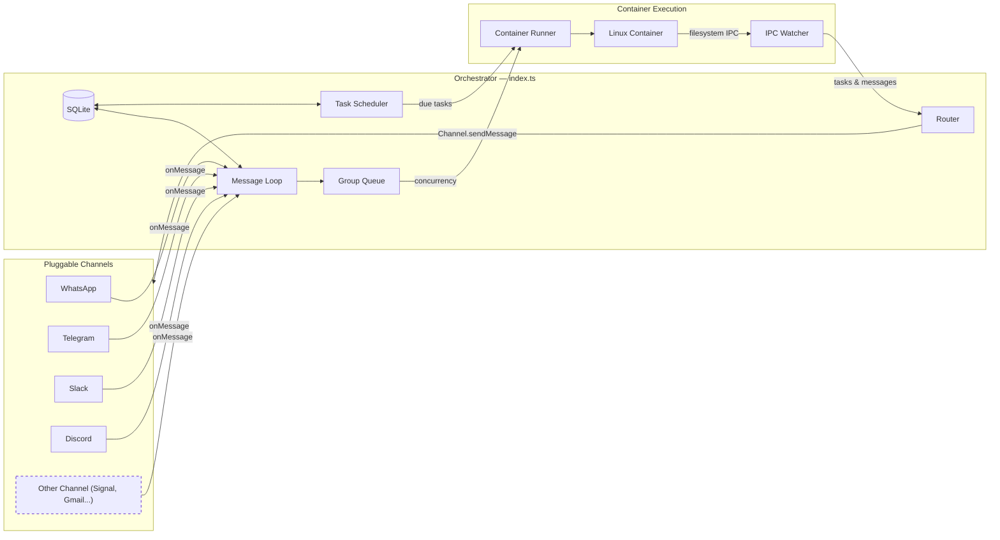

<p align="center">
  
</p>

<p align="center">
  A pluggable AI assistant platform. Agents run in containers. Channels install as skills. Small enough to read, built to be yours.
</p>

<p align="center">
  <a href="https://nanoclaw.dev">nanoclaw.dev</a>&nbsp; • &nbsp;
  <a href="README_zh.md">中文</a>&nbsp; • &nbsp;
  <a href="https://discord.gg/VDdww8qS42"></a>&nbsp; • &nbsp;
  <a href="repo-tokens"></a>
</p>
<p align="center">
  <a href="https://github.com/qwibitai/nanoclaw/actions"></a>&nbsp; • &nbsp;
  <a href="https://github.com/qwibitai/nanoclaw/blob/main/LICENSE"></a>&nbsp; • &nbsp;
  &nbsp; • &nbsp;
  <a href="https://github.com/qwibitai/nanoclaw/pulls"></a>
</p>

NanoClaw ships as a minimal core with **no channels built in.** You add exactly the channels you need — WhatsApp, Telegram, Slack, Discord, Gmail — by running [skills](#skills-over-features) inside Claude Code. Each channel self-registers at startup; unconfigured channels are silently skipped. No feature flags, no config toggles — just clean code that does what you need.

## Why

[OpenClaw](https://github.com/openclaw/openclaw) is an impressive project, but I wouldn't have been able to sleep if I had given complex software I didn't understand full access to my life. OpenClaw has nearly half a million lines of code, 53 config files, and 70+ dependencies. Its security is at the application level (allowlists, pairing codes) rather than true OS-level isolation. Everything runs in one Node process with shared memory.

NanoClaw provides that same core functionality, but in a codebase small enough to understand: one process and a handful of files. Claude agents run in their own Linux containers with filesystem isolation, not merely behind permission checks.

## Quick Start

```bash
git clone https://github.com/qwibitai/NanoClaw.git
cd NanoClaw
claude                         # launches Claude Code CLI
```

Inside the Claude Code prompt, run:

```
/setup                         # installs deps, authenticates, configures containers
/add-whatsapp                  # or /add-telegram, /add-slack, /add-discord, /add-gmail
```

> **Note:** Commands prefixed with `/` are [Claude Code skills](https://code.claude.com/docs/en/skills). Type them inside the `claude` CLI prompt, not in your regular terminal.

You can run multiple channels simultaneously or use just one.

## Upgrading from Pre-Pluggable Versions

> **Breaking change.** WhatsApp is no longer bundled in the core — it's now a pluggable skill, just like every other channel. If you're upgrading an existing installation:
>
> ```bash
> claude                       # open Claude Code in your NanoClaw directory
> ```
> ```
> /add-whatsapp                # re-installs WhatsApp as a pluggable channel
> ```
>
> Your existing auth credentials, groups, and scheduled tasks are preserved. The skill just wires WhatsApp back into the new channel registry.

## Philosophy

<a id="skills-over-features"></a>

**Small enough to understand.** One process, a few source files, no microservices. Want to understand the full codebase? Ask Claude Code to walk you through it. The whole thing fits in a single context window.

**Secure by isolation.** Agents run in Linux containers (Apple Container on macOS, or Docker). They can only see what's explicitly mounted. Bash access is safe because commands execute inside the container, not on your host.

**Built for the individual.** NanoClaw isn't a monolithic framework; it's software that fits each user's exact needs. Fork it, point Claude Code at it, and make it yours.

**Customization = code changes.** No configuration sprawl. Want different behavior? Modify the code. The codebase is small enough that this is safe.

**AI-native.**
- No installation wizard — Claude Code guides setup.
- No monitoring dashboard — ask Claude what's happening.
- No debugging tools — describe the problem and Claude fixes it.

**Skills over features.** This is the core design principle. Traditional platforms bolt on every channel behind feature flags and configuration layers. NanoClaw does the opposite: channels, integrations, and capabilities are [Claude Code skills](https://code.claude.com/docs/en/skills) that **mutate your fork.** Run `/add-telegram` and you get clean, auditable Telegram code committed to your codebase — not a 15-channel abstraction layer you'll never read.

**Best harness, best model.** NanoClaw runs on the Claude Agent SDK — you're running Claude Code directly. Its coding and problem-solving capabilities let it modify, expand, and tailor NanoClaw to each user.

## What It Supports

- **Pluggable channels** — Add WhatsApp (`/add-whatsapp`), Telegram (`/add-telegram`), Slack (`/add-slack`), Discord (`/add-discord`), or Gmail (`/add-gmail`). Run one or many simultaneously.
- **Isolated group context** — Each group has its own `CLAUDE.md` memory, isolated filesystem, and runs in its own container sandbox.
- **Main channel** — Your private channel (self-chat) for admin control; every other group is fully isolated.
- **Scheduled tasks** — Recurring jobs that run Claude and can message you back.
- **Web access** — Search and fetch content from the web.
- **Container isolation** — Agents sandboxed in Apple Container (macOS) or Docker (macOS/Linux).
- **Agent Swarms** — Spin up teams of specialized agents that collaborate on complex tasks via [Agent Teams](https://code.claude.com/docs/en/agent-teams).
- **Zero-config channel discovery** — Channels auto-detect credentials at startup. If credentials exist, the channel connects. Nothing to toggle.

## Usage

Talk to your assistant with the trigger word (default: `@Andy`) from any connected channel:

```
@Andy send an overview of the sales pipeline every weekday morning at 9am (has access to my Obsidian vault folder)
@Andy review the git history for the past week each Friday and update the README if there's drift
@Andy every Monday at 8am, compile news on AI developments from Hacker News and TechCrunch and message me a briefing
```

From the main channel (your self-chat), manage groups and tasks:
```
@Andy list all scheduled tasks across groups
@Andy pause the Monday briefing task
@Andy join the Family Chat group
```

## Customizing

No configuration files. Tell Claude Code what you want:

- "Change the trigger word to @Bob"
- "Make responses shorter and more direct"
- "Add a custom greeting when I say good morning"
- "Store conversation summaries weekly"

Or run `/customize` inside Claude Code for guided changes.

The codebase is small enough that Claude can safely modify it.

## Contributing

**Don't add features. Add skills.**

Want to add a new channel or integration? Contribute a skill (`.claude/skills/add-<name>/`) that teaches Claude Code how to transform a NanoClaw installation. Users run the skill on their fork and get clean code that does exactly what they need — not a bloated system trying to support every use case simultaneously.

See existing channel skills (`/add-whatsapp`, `/add-telegram`, `/add-slack`, `/add-discord`, `/add-gmail`) for the pattern.

### RFS (Request for Skills)

Skills we'd like to see:

**Communication Channels**
- `/add-signal` — Add Signal as a channel

**Session Management**
- `/clear` — Compact the conversation (summarize context while preserving critical information in the same session). Requires figuring out how to trigger compaction programmatically via the Claude Agent SDK.

**Platform Support**
- `/setup-windows` — Windows support via WSL2 + Docker

## Requirements

- macOS or Linux
- Node.js 20+
- [Claude Code](https://claude.ai/download)
- [Apple Container](https://github.com/apple/container) (macOS) or [Docker](https://docker.com/products/docker-desktop) (macOS/Linux)

## Architecture



Single Node.js process. Channels are pluggable — each registers a factory function via `src/channels/registry.ts`, and the orchestrator instantiates whichever channels have credentials present. Agents execute in isolated Linux containers. Per-group message queue with concurrency control. IPC via filesystem.

Key files:

| File | Purpose |
|------|---------|
| `src/index.ts` | Orchestrator: state, message loop, agent invocation |
| `src/channels/registry.ts` | Channel registry — the pluggable channel system |
| `src/channels/index.ts` | Barrel imports that trigger channel self-registration |
| `src/router.ts` | Message formatting and outbound routing |
| `src/ipc.ts` | IPC watcher and task processing |
| `src/group-queue.ts` | Per-group queue with global concurrency limit |
| `src/container-runner.ts` | Spawns streaming agent containers |
| `src/task-scheduler.ts` | Runs scheduled tasks |
| `src/db.ts` | SQLite operations (messages, groups, sessions, state) |
| `src/types.ts` | `Channel` interface, message types |
| `groups/*/CLAUDE.md` | Per-group agent memory |

### Adding a Channel

Channels follow a self-registration pattern. Each channel skill adds a file to `src/channels/` that:

1. Implements the `Channel` interface (`connect`, `sendMessage`, `ownsJid`, `disconnect`, ...)
2. Calls `registerChannel(name, factory)` at module load
3. Returns `null` from the factory if credentials are missing

The barrel file `src/channels/index.ts` imports all channel modules, triggering registration. The orchestrator loops through registered channels and connects whichever ones return a valid instance. No if-else chains, no feature flags — just the factory pattern.

## FAQ

**Why Docker?**

Docker provides cross-platform support (macOS, Linux and even Windows via WSL2) and a mature ecosystem. On macOS, you can optionally switch to Apple Container via `/convert-to-apple-container` for a lighter-weight native runtime.

**Can I run this on Linux?**

Yes. Docker is the default runtime and works on both macOS and Linux. Run `/setup` inside Claude Code.

**Is this secure?**

Agents run in containers, not behind application-level permission checks. They can only access explicitly mounted directories. You should still review what you're running, but the codebase is small enough that you actually can. See [docs/SECURITY.md](docs/SECURITY.md) for the full security model.

**How do I add a channel?**

Run the corresponding skill inside Claude Code: `/add-whatsapp`, `/add-telegram`, `/add-slack`, `/add-discord`, or `/add-gmail`. Each skill installs the channel code, guides you through authentication, and registers it. You can run multiple channels at the same time.

**Why no configuration files?**

We don't want configuration sprawl. Every user should customize NanoClaw so that the code does exactly what they need, rather than configuring a generic system. If you prefer config files, tell Claude to add them.

**How do I debug issues?**

Ask Claude Code. "Why isn't the scheduler running?" "What's in the recent logs?" "Why did this message not get a response?" Or run `/debug` inside Claude Code for guided troubleshooting.

**Why isn't setup working for me?**

During setup, Claude will try to dynamically fix issues. If that doesn't work, run `/debug` inside Claude Code. If Claude finds an issue likely affecting other users, open a PR to modify the setup SKILL.md.

**What changes will be accepted into the codebase?**

Security fixes, bug fixes, and clear improvements to the core. Everything else — new channels, integrations, platform support — should be contributed as skills. This keeps the base system minimal and lets every user customize their installation without inheriting features they don't want.

## Community

Questions? Ideas? [Join the Discord](https://discord.gg/VDdww8qS42).

## License

MIT
