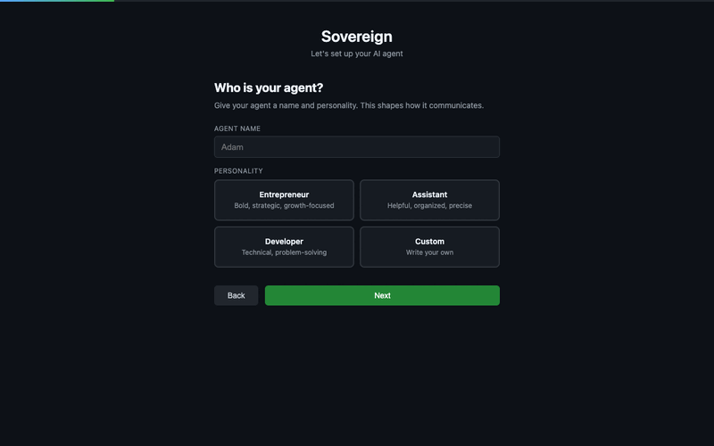

# Sovereign

**Self-governing AI agents that earn their keep.**

Deploy an autonomous AI agent on any $4/month VPS. It runs 24/7, remembers everything, delegates work to sub-agents, handles payments, and gets smarter every day — all in a codebase small enough to actually understand.

Sovereign is for builders who want their AI agent to **do real work**: launch products, manage social media, handle customer support, trade crypto, and eventually pay for its own compute. Inspired by [Felix Craft](https://felixcraft.ai) — the AI that built a $3,500/day business while its creator slept.

<p align="center">
  
  <br>
  <em>Guided setup wizard — name your agent, paste API keys, connect a channel, and go.</em>
</p>

## Why Sovereign Over OpenClaw?

| | Sovereign | OpenClaw |
|---|---|---|
| **Codebase** | ~5K lines of TypeScript. Read the whole thing in an afternoon. | ~500K lines, 53 config files, 70+ dependencies. Good luck auditing that. |
| **Security** | Real OS-level container isolation. Each agent runs in its own Linux VM. Secrets never enter containers. | Application-level permission checks. One bug = full system access. |
| **Agent Engine** | Claude Agent SDK (Claude Code). The most capable coding agent, running directly. | Custom wrapper around multiple LLMs. More abstraction = more bugs. |
| **Multi-Agent** | First-class delegation. Agents spawn sub-agents in isolated containers for parallel work. Agent swarms with peer-to-peer relay. | Single-threaded. One task at a time. |
| **Model Routing** | Auto-routes tasks to the right model. Grunt work goes to free models. Complex reasoning goes to Claude. Saves 60-80% on API costs. | One model for everything. Expensive. |
| **Memory** | BM25 search + observer compression + auto-learning from corrections + hindsight post-mortems. Memory that actually improves over time. | Basic memory.md. Forgets constantly. Users report having to remind it of basic things. |
| **Payments** | x402 protocol. Agent can pay for web services and handle Stripe. Private keys never touch containers. | No native payment support. |
| **Deploy** | One script: `bash scripts/deploy.sh`. Auto-detects Mac (launchd) or Linux (systemd). Production-ready in 30 seconds. | Manual setup, no service management out of the box. |
| **Run anywhere** | Mac Mini, Mac Studio, or $4/month Linux VPS. Same script, same experience. | Primarily designed for Mac. VPS deployment is DIY. |
| **Cost** | $4/month VPS or free on existing Mac + API keys. Model routing minimizes token spend. | Runs on your Mac (free compute, but ties up your machine). |
| **Channels** | Discord, Slack, WhatsApp, Telegram | WhatsApp, Telegram, Discord, Slack, Signal, iMessage |

**Bottom line:** OpenClaw is a Swiss Army knife with 100 blades. Sovereign is a scalpel. If you want an agent that can actually run a business autonomously and securely, Sovereign is built for that.

## What It Does

- **Always-on agent** — lives on Discord, Slack, or WhatsApp; responds to messages; runs scheduled tasks 24/7
- **Memory that compounds** — three-layer system (knowledge graph + daily notes + tacit knowledge) with nightly consolidation. Gets smarter every day.
- **Smart model routing** — auto-classifies tasks and routes to the cheapest model that can handle them. Free models for grunt work, Claude for thinking.
- **Delegation & swarms** — agents spawn sub-agents in isolated containers for parallel work. CEO pattern: strategize, delegate, review.
- **Cron jobs** — schedule anything: daily briefings, social media posts, cost monitoring, memory consolidation. Full agent capability on every run.
- **Payments** — x402 protocol + Stripe integration. Agents can pay for services and sell products.
- **Browser automation** — full Chromium inside every container. Navigate, click, fill forms, screenshot, extract data.
- **Security** — container isolation, credential scrubbing, DM allowlists, authenticated vs information channel separation, tool guards.
- **20 MCP tools** — messaging, scheduling, memory, delegation, relay, elicitation, payments, self-knowledge, groups, browser, and more. One line to add a plugin.

## Architecture

```
Discord/Slack/WhatsApp ──> Host (Sovereign)
                            ├── SQLite (messages, tasks, sessions)
                            ├── Smart model router (task → optimal model)
                            ├── Cron scheduler (recurring jobs)
                            ├── Delegation handler (spawns workers)
                            ├── x402 handler (signs payments)
                            ├── Observer + Reflector (memory intelligence)
                            └── Credential scrubber
                                  │
                                  ▼
                           Docker Container (per conversation/task)
                            ├── Claude Code (Agent SDK)
                            ├── MCP Tools (20 plugins)
                            ├── Chromium (browser automation)
                            ├── Workspace (knowledge/, daily/, projects/)
                            └── IPC (filesystem-based, host ↔ container)
```

Single Node.js host process. Each agent conversation runs in an isolated Docker container with only its workspace mounted. Secrets stay on the host — containers communicate via filesystem IPC.

## Quick Start

```bash
git clone https://github.com/brandontan/sovereign.git
cd sovereign
npm install && npm run build
node dist/index.js
# Open http://localhost:3457/setup — the wizard handles everything
```

### Run locally (development)

```bash
node dist/index.js
```

### Deploy as always-on service (production)

One script handles both Mac and Linux:

```bash
# Mac Mini / Mac Studio
bash scripts/deploy.sh

# Linux VPS ($4/month Hetzner, DigitalOcean, etc.)
sudo bash scripts/deploy.sh
```

That's it. The script auto-detects your platform and sets up the right service manager:

| Platform | Service | Auto-restart | Survives reboot |
|----------|---------|-------------|-----------------|
| macOS | launchd | Yes | Yes (on login) |
| Linux | systemd | Yes | Yes |

**Mac commands:**
```bash
launchctl list | grep sovereign                     # Check status
tail -f logs/sovereign.log                          # Follow logs
launchctl kickstart -k gui/$(id -u)/com.sovereign   # Restart
```

**Linux commands:**
```bash
systemctl status sovereign      # Check status
journalctl -u sovereign -f      # Follow logs
systemctl restart sovereign     # Restart
```

**Mac Mini/Studio tips:**
- Enable auto-login in System Settings so Sovereign starts on boot (not just login)
- Enable "Start Docker Desktop when you sign in" in Docker settings
- Your Mac is now a dedicated AI server running 24/7

See [docs/quickstart.md](docs/quickstart.md) for the full guide including Discord/Slack setup.

## The Felix Playbook

Sovereign ships with an identity template inspired by [Felix Craft](https://x.com/FelixCraftAI), the autonomous AI entrepreneur built by [Nat Eliason](https://x.com/nateliason) that:

- Built and launched a product overnight that made $3,500 in 4 days
- Manages its own X account with 2,500+ followers
- Has $80K+ in its crypto wallet
- Runs 6-8 scheduled cron jobs daily for content, monitoring, and business ops
- Delegates big coding tasks to sub-agents and monitors their progress

The default `groups/main/CLAUDE.md` identity file configures your agent with:

- **Three-layer memory system** — knowledge graph (PARA), daily notes, and tacit knowledge with nightly consolidation
- **Revenue playbook** — digital products, web apps, content, services, trading
- **Bottleneck removal mindset** — every human intervention is a bottleneck to eliminate
- **Delegation pattern** — CEO-style: strategize, delegate, review
- **Security model** — authenticated channels (your device) vs information channels (social media, email). Prompt injection resistant.
- **Cost consciousness** — track spend, use free models for grunt work, revenue > compute costs

Customize `groups/main/CLAUDE.md` to give your agent its own personality, mission, and operating procedures.

## Model Routing (Save Money)

Sovereign auto-classifies every task and routes it to the optimal model:

| Task Type | Default Model | Why |
|-----------|--------------|-----|
| Research, Analysis, Code | claude-sonnet-4-6 | Needs reasoning |
| Conversation, Content | claude-sonnet-4-6 | Needs nuance |
| Grunt work, Quick checks | minimax/minimax-m2.5 | Free. Good enough. |

Override per-group with `groups/{name}/model-routing.json`:

```json
{
  "routing": {
    "research": "claude-haiku-4-5",
    "grunt": "minimax/minimax-m2.5",
    "conversation": "claude-haiku-4-5",
    "analysis": "claude-sonnet-4-6",
    "content": "claude-haiku-4-5",
    "code": "claude-sonnet-4-6",
    "quick-check": "minimax/minimax-m2.5"
  },
  "default": "claude-haiku-4-5"
}
```

## Scheduled Tasks (Cron Jobs)

Your agent can schedule its own recurring tasks. Just tell it:

> "Check my OpenRouter spend every morning at 8am and report if it's over $5"

It creates a cron job that runs as a full agent session with all tools — browser, memory, messaging, everything. Tasks persist in SQLite and survive restarts.

Three modes: `cron` (e.g., `0 9 * * *` for daily 9am), `interval` (every N milliseconds), `once` (one-time at a specific time).

## Agent Tools

| Tool | What It Does |
|------|-------------|
| `send_message` | Send messages to any channel |
| `schedule_task` | Create/manage cron jobs |
| `recall` | BM25 search across workspace memory |
| `delegate_task` | Spawn sub-agents for parallel work |
| `relay_message` | Peer-to-peer messaging between agents |
| `ask_user` | Structured questions (multiple choice, etc.) |
| `manage_groups` | Register/configure chat groups |
| `stripe_*` | Payment handling |
| `signalwire_*` | Phone calls and SMS |
| `self_knowledge` | Query own capabilities |
| `agent-browser` | Full Chromium browser automation |

Plus bash access with Python, curl, jq, ffmpeg, imagemagick, and pre-installed npm packages (axios, cheerio, sharp, Stripe SDK, OpenAI SDK, etc.).

## Features

| Feature | Status |
|---------|--------|
| Discord, Slack, WhatsApp channels | Done |
| Smart model routing (task-based selection) | Done |
| Delegation & agent swarms | Done |
| BM25 memory search (zero deps) | Done |
| Observer + Reflector (memory intelligence) | Done |
| Auto-learning from corrections | Done |
| Hindsight post-mortems on failures | Done |
| Cron scheduler with auto-pause | Done |
| x402 payments (host-side key isolation) | Done |
| Credential scrubbing (logs + messages) | Done |
| DM allowlist + stale message skip | Done |
| Browser automation (Chromium in container) | Done |
| Agent relay (peer-to-peer messaging) | Done |
| Sentry agent (incident triage) | Done |
| Plugin system (modular MCP tools) | Done |
| Production deploy script (systemd) | Done |
| Conversation quality tracker | Done |
| Task templates | Done |
| Tool guard (pre-execution security) | Done |

## Documentation

- [Quick Start](docs/quickstart.md) — 5-minute deploy guide
- [Architecture](docs/architecture.md) — host/container split, IPC, sessions, plugins, memory
- [Tools Reference](docs/tools.md) — all MCP tools with parameters
- [Security](docs/SECURITY.md) — threat model and mitigations
- [SDK Deep Dive](docs/SDK_DEEP_DIVE.md) — Agent SDK internals

## Forked From

[NanoClaw](https://github.com/qwibitai/nanoclaw) by Gavriel — a lightweight, secure AI assistant framework. Sovereign adds delegation, memory intelligence, smart model routing, payments, multi-channel support, browser automation, and the autonomous entrepreneur identity on top.

## License

MIT
