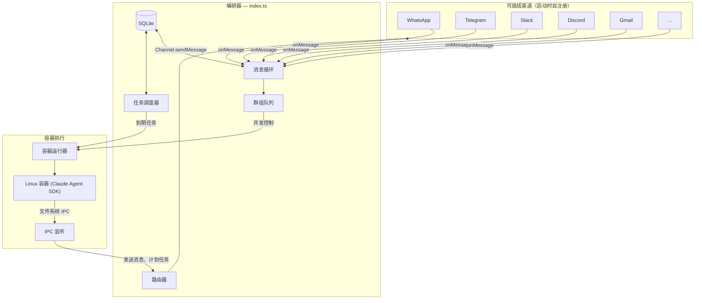

<p align="center">
  
</p>

<p align="center">
  可插拔的 AI 助手平台。智能体在容器中运行。渠道以技能形式安装。小巧易读，为您量身定制。
</p>

<p align="center">
  <a href="https://nanoclaw.dev">nanoclaw.dev</a>&nbsp; • &nbsp;
  <a href="README.md">English</a>&nbsp; • &nbsp;
  <a href="https://discord.gg/VDdww8qS42"></a>&nbsp; • &nbsp;
  <a href="repo-tokens"></a>
</p>
<p align="center">
  <a href="https://github.com/qwibitai/nanoclaw/actions"></a>&nbsp; • &nbsp;
  <a href="https://github.com/qwibitai/nanoclaw/blob/main/LICENSE"></a>&nbsp; • &nbsp;
  &nbsp; • &nbsp;
  <a href="https://github.com/qwibitai/nanoclaw/pulls"></a>
</p>

NanoClaw 以最小核心交付，**不内置任何渠道。** 您可以在 Claude Code 中运行[技能](#技能优于功能)来添加所需的渠道 — WhatsApp、Telegram、Slack、Discord、Gmail。每个渠道在启动时自注册；未配置的渠道会被静默跳过。没有功能开关，没有配置切换 — 只有干净的、做您需要的事情的代码。

## 为什么

[OpenClaw](https://github.com/openclaw/openclaw) 是一个令人印象深刻的项目，但我无法安心使用一个我不了解却能访问我个人隐私的软件。OpenClaw 有近 50 万行代码、53 个配置文件和 70+ 个依赖项。其安全性是应用级别的（通过白名单、配对码实现），而非操作系统级别的隔离。所有东西都在一个共享内存的 Node 进程中运行。

NanoClaw 用一个您能快速理解的代码库，为您提供了同样的核心功能。只有一个进程，少数几个文件。智能体运行在具有文件系统隔离的真实 Linux 容器中，而不是依赖于权限检查。

## 快速开始

```bash
git clone https://github.com/qwibitai/nanoclaw.git
cd nanoclaw
claude                         # 启动 Claude Code CLI
```

在 Claude Code 提示符中运行：

```
/setup                         # 安装依赖、身份验证、配置容器
/add-whatsapp                  # 或 /add-telegram、/add-slack、/add-discord、/add-gmail
```

> **注意：** 以 `/` 开头的命令是 [Claude Code 技能](https://code.claude.com/docs/en/skills)。请在 `claude` CLI 提示符中输入，而非在普通终端中。

您可以同时运行多个渠道，或只使用一个。

## 从旧版本升级

> **破坏性变更。** WhatsApp 不再内置于核心 — 它现在是一个可插拔技能，与其他渠道一样。如果您正在升级现有安装：
>
> ```bash
> claude                       # 在 NanoClaw 目录中打开 Claude Code
> ```
> ```
> /add-whatsapp                # 以可插拔渠道形式重新安装 WhatsApp
> ```
>
> 您现有的身份验证凭据、群组和计划任务会被保留。该技能只是将 WhatsApp 重新接入新的渠道注册表。

## 设计哲学

<a id="技能优于功能"></a>

**小巧易懂。** 单一进程，少量源文件，无微服务。想了解整个代码库？让 Claude Code 带您过一遍。整个项目可以装进一个上下文窗口。

**通过隔离保障安全。** 智能体运行在 Linux 容器（macOS 上是 Apple Container，或 Docker）中。它们只能看到被明确挂载的内容。Bash 访问是安全的，因为命令在容器内执行，不会操作宿主机。

**为个人打造。** NanoClaw 不是一个单体框架；它是为每个用户的精确需求而生的软件。Fork 它，让 Claude Code 改造它，让它成为您的。

**定制即代码修改。** 没有繁杂的配置文件。想要不同的行为？直接修改代码。代码库足够小，这样做是安全的。

**AI 原生。**
- 无安装向导 — 由 Claude Code 指导安装。
- 无监控仪表盘 — 直接询问 Claude 即可。
- 无调试工具 — 描述问题，Claude 会修复它。

**技能优于功能。** 这是核心设计原则。传统平台在功能开关和配置层后面堆砌每个渠道。NanoClaw 恰恰相反：渠道、集成和功能以 [Claude Code 技能](https://code.claude.com/docs/en/skills) 的形式**变换您的 fork**。运行 `/add-telegram`，您的代码库中就有了干净、可审计的 Telegram 代码 — 而不是一个您永远不会阅读的 15 渠道抽象层。

**最好的工具套件，最好的模型。** NanoClaw 运行在 Claude Agent SDK 之上 — 您直接运行的就是 Claude Code。其编码和问题解决能力使它能够修改、扩展和定制 NanoClaw 以适应每个用户。

## 功能支持

- **可插拔渠道** — 添加 WhatsApp (`/add-whatsapp`)、Telegram (`/add-telegram`)、Slack (`/add-slack`)、Discord (`/add-discord`) 或 Gmail (`/add-gmail`)。可同时运行一个或多个。
- **隔离的群组上下文** — 每个群组拥有独立的 `CLAUDE.md` 记忆、隔离的文件系统，在各自的容器沙箱中运行。
- **主频道** — 您的私有频道（self-chat），用于管理控制；其他所有群组完全隔离。
- **计划任务** — 运行 Claude 的周期性作业，可以给您回发消息。
- **网络访问** — 搜索和抓取网页内容。
- **容器隔离** — 智能体在 Apple Container (macOS) 或 Docker (macOS/Linux) 的沙箱中运行。
- **智能体集群** — 通过 [Agent Teams](https://code.claude.com/docs/en/agent-teams) 启动多个专业智能体团队，协作完成复杂任务。
- **零配置渠道发现** — 渠道在启动时自动检测凭据。如果凭据存在，渠道就会连接。无需任何切换。

## 使用方法

使用触发词（默认为 `@Andy`）从任何已连接的渠道与助手对话：

```
@Andy 每周一到周五早上9点，给我发一份销售渠道的概览（需要访问我的 Obsidian vault 文件夹）
@Andy 每周五回顾过去一周的 git 历史，如果与 README 有出入，就更新它
@Andy 每周一早上8点，从 Hacker News 和 TechCrunch 收集关于 AI 发展的资讯，然后发给我一份简报
```

在主频道（您的 self-chat）中，管理群组和任务：
```
@Andy 列出所有群组的计划任务
@Andy 暂停周一简报任务
@Andy 加入"家庭聊天"群组
```

## 定制

没有配置文件。告诉 Claude Code 您想要什么：

- "把触发词改成 @Bob"
- "回答要更简短直接"
- "当我说早上好的时候，加一个自定义的问候"
- "每周存储一次对话摘要"

或者在 Claude Code 中运行 `/customize` 进行引导式修改。

代码库足够小，Claude 可以安全地修改它。

## 贡献

**不要添加功能，添加技能。**

想要添加新渠道或集成？贡献一个技能 (`.claude/skills/add-<name>/`)，教 Claude Code 如何改造 NanoClaw 安装。用户在自己的 fork 上运行该技能，就能得到只做他们需要事情的整洁代码 — 而不是一个试图同时支持所有用例的臃肿系统。

参考现有渠道技能（`/add-whatsapp`、`/add-telegram`、`/add-slack`、`/add-discord`、`/add-gmail`）了解模式。

### RFS (技能征集)

我们希望看到的技能：

**通信渠道**
- `/add-signal` — 添加 Signal 作为渠道

**会话管理**
- `/clear` — 压缩会话（在同一会话中总结上下文，同时保留关键信息）。需要研究如何通过 Claude Agent SDK 以编程方式触发压缩。

**平台支持**
- `/setup-windows` — 通过 WSL2 + Docker 支持 Windows

## 系统要求

- macOS 或 Linux
- Node.js 20+
- [Claude Code](https://claude.ai/download)
- [Apple Container](https://github.com/apple/container) (macOS) 或 [Docker](https://docker.com/products/docker-desktop) (macOS/Linux)

## 架构



单一 Node.js 进程。渠道可插拔 — 每个渠道通过 `src/channels/registry.ts` 注册工厂函数，编排器实例化具有凭据的渠道。智能体在隔离的 Linux 容器中执行。每个群组的消息队列带有并发控制。通过文件系统进行 IPC。

关键文件：

| 文件 | 用途 |
|------|------|
| `src/index.ts` | 编排器：状态管理、消息循环、智能体调用 |
| `src/channels/registry.ts` | 渠道注册表 — 可插拔渠道系统 |
| `src/channels/index.ts` | 触发渠道自注册的桶导入 |
| `src/router.ts` | 消息格式化与出站路由 |
| `src/ipc.ts` | IPC 监听与任务处理 |
| `src/group-queue.ts` | 带全局并发限制的群组队列 |
| `src/container-runner.ts` | 生成流式智能体容器 |
| `src/task-scheduler.ts` | 运行计划任务 |
| `src/db.ts` | SQLite 操作（消息、群组、会话、状态） |
| `src/types.ts` | `Channel` 接口、消息类型 |
| `groups/*/CLAUDE.md` | 各群组的智能体记忆 |

### 添加渠道

渠道遵循自注册模式。每个渠道技能向 `src/channels/` 添加一个文件：

1. 实现 `Channel` 接口（`connect`、`sendMessage`、`ownsJid`、`disconnect`...）
2. 在模块加载时调用 `registerChannel(name, factory)`
3. 如果凭据缺失，工厂函数返回 `null`

桶文件 `src/channels/index.ts` 导入所有渠道模块，触发注册。编排器遍历已注册的渠道，连接所有返回有效实例的渠道。没有 if-else 链，没有功能开关 — 只有工厂模式。

## FAQ

**为什么是 Docker？**

Docker 提供跨平台支持（macOS 和 Linux）和成熟的生态系统。在 macOS 上，您可以在 Claude Code 中运行 `/convert-to-apple-container` 切换到 Apple Container，以获得更轻量级的原生运行时。

**我可以在 Linux 上运行吗？**

可以。Docker 是默认运行时，在 macOS 和 Linux 上都可用。在 Claude Code 中运行 `/setup`。

**这个项目安全吗？**

智能体在容器中运行，而不是在应用级权限检查之后。它们只能访问被明确挂载的目录。您仍然应该审查您运行的代码，但这个代码库小到您真的可以做到。完整的安全模型请见 [docs/SECURITY.md](docs/SECURITY.md)。

**如何添加渠道？**

在 Claude Code 中运行相应的技能：`/add-whatsapp`、`/add-telegram`、`/add-slack`、`/add-discord` 或 `/add-gmail`。每个技能会安装渠道代码，引导您完成身份验证并注册渠道。您可以同时运行多个渠道。

**为什么没有配置文件？**

我们不希望配置泛滥。每个用户都应该定制它，让代码完全符合他们的需求，而不是去配置一个通用的系统。如果您喜欢用配置文件，告诉 Claude 让它加上。

**我该如何调试问题？**

问 Claude Code。"为什么计划任务没有运行？" "最近的日志里有什么？" "为什么这条消息没有得到回应？" 或者在 Claude Code 中运行 `/debug` 进行引导式故障排除。

**为什么我的安装不成功？**

安装过程中，Claude 会尝试动态修复问题。如果不行，在 Claude Code 中运行 `/debug`。如果 Claude 发现一个可能影响其他用户的问题，请开一个 PR 来修改 SKILL.md 安装文件。

**什么样的代码更改会被接受？**

安全修复、bug 修复，以及对核心的明确改进。其他一切 — 新渠道、集成、平台支持 — 都应该作为技能来贡献。这使得基础系统保持最小化，并让每个用户可以定制他们的安装，而无需继承他们不想要的功能。

## 社区

有任何疑问或建议？欢迎[加入 Discord 社区](https://discord.gg/VDdww8qS42)与我们交流。

## 许可证

MIT
