# Agent Hub — Architecture (état au 2026-03-25)

Document de review pour Ahmed. Décrit l'état réel déployé, pas la cible.

## Vue d'ensemble

Un seul process Python 3.13 (`orchestrator.py`) tourne sur le Mac mini. Il gère 2 agents en parallèle, chacun avec son propre thread et sa propre queue d'événements. Le triage des emails/messages se fait via Gemini 2.5 Flash (Google AI API). Les escalades (pas encore en prod) vont vers Claude via Anthropic API.

```
Mode actuel : SHADOW (log-only, aucune action réelle)
Process     : 1 Python process, multi-threaded
Polling     : Gmail 2min 24/7, Chat 2min jour / 15min nuit
Coût/jour   : ~$1.50 (Gemini Flash triage)
```

## Diagramme

```mermaid
graph TB
    subgraph "Mac mini — Python 3.13"
        ORCH[orchestrator.py<br/>PID unique]

        subgraph "Agent Threads"
            BOTTI[AgentThread: botti<br/>sam@bestoftours.co.uk<br/>Claude Sonnet 4.6]
            THAIS[AgentThread: thais<br/>thais@bestoftours.co.uk<br/>Claude Opus 4.6]
        end

        subgraph "Pollers (daemon threads)"
            PG_B[Gmail Poll botti<br/>every 2min]
            PG_T[Gmail Poll thais<br/>every 2min]
            PC_B[Chat Poll botti<br/>2min day / 15min night]
            PC_T[Chat Poll thais<br/>2min day / 15min night]
        end

        TM[TokenManager<br/>hourly check]
        WH[Webhook Server<br/>FastAPI :8090]
        CT[CostTracker<br/>$20/day hard limit]
    end

    subgraph "Google AI API"
        GEMINI[Gemini 2.5 Flash<br/>API Key restricted]
    end

    subgraph "Anthropic API"
        CLAUDE[Claude Sonnet/Opus<br/>for escalations<br/>not yet active]
    end

    subgraph "Google Workspace (gws CLI)"
        GMAIL_S[Gmail sam@]
        GMAIL_T[Gmail thais@]
        CHAT_S[Chat sam@<br/>scope missing]
        CHAT_T[Chat thais@<br/>scope missing]
    end

    subgraph "GCP Cloud Run (existing, not connected)"
        CR1[botti-voice<br/>europe-west1]
        CR2[test-email-receiver<br/>us-central1]
    end

    subgraph "Pub/Sub (existing, not routed to Mac)"
        PS1[gmail-push-topic]
        PS2[gmail-notifications]
    end

    PG_B -->|gws gmail| GMAIL_S
    PG_T -->|gws gmail| GMAIL_T
    PC_B -->|gws chat| CHAT_S
    PC_T -->|gws chat| CHAT_T

    GMAIL_S --> PG_B
    GMAIL_T --> PG_T

    PG_B -->|push event| BOTTI
    PG_T -->|push event| THAIS
    PC_B -->|push event| BOTTI
    PC_T -->|push event| THAIS

    BOTTI -->|triage batch| GEMINI
    THAIS -->|triage batch| GEMINI

    BOTTI -.->|escalate| CLAUDE
    THAIS -.->|escalate| CLAUDE

    PS1 -->|push| CR2
    PS2 -->|push| CR1

    BOTTI --> CT
    THAIS --> CT

    style CHAT_S stroke-dasharray: 5 5,stroke:red
    style CHAT_T stroke-dasharray: 5 5,stroke:red
    style CR1 stroke-dasharray: 5 5,stroke:orange
    style CR2 stroke-dasharray: 5 5,stroke:orange
    style CLAUDE stroke-dasharray: 5 5,stroke:gray
```



## Agents

| Agent | Compte GWS | LLM escalade | LLM triage | Channels | Rôle |
|-------|-----------|-------------|------------|----------|------|
| **botti** | sam@bestoftours.co.uk | Claude Sonnet 4.6 | Gemini 2.5 Flash | Gmail, Calendar, Chat | Assistant opérationnel |
| **thais** | thais@bestoftours.co.uk | Claude Opus 4.6 | Gemini 2.5 Flash | Gmail, Calendar, Chat | COSY stratégique |

## Flux de données

### 1. Gmail Triage (actif)

```
Gmail inbox (unread) → gws CLI poll (2min)
  → fetch message metadata (From, Subject, Date, Snippet)
  → batch de N emails → Gemini 2.5 Flash triage
  → classification: IGNORE / NOTIFY / DRAFT / RESPOND / ESCALATE
  → shadow mode: log to shadow_YYYY-MM-DD.jsonl
  → prod mode: execute action (mark read, reply, draft, escalate to Claude)
```

### 2. Chat Triage (scopes manquants)

```
Chat spaces → gws CLI poll (2min day / 15min night)
  → fetch messages from all ROOM/SPACE/GROUP_CHAT spaces
  → batch → Gemini 2.5 Flash triage
  → classification: IGNORE / RESPOND / ESCALATE
  → shadow: log | prod: reply or escalate
```

**Bloquant** : les comptes sam@ et thais@ n'ont pas les scopes OAuth `chat.spaces` et `chat.messages`. Ré-auth nécessaire.

### 3. Webhooks (pas connectés)

Pub/Sub topics existent (`gmail-push-topic`, `gmail-notifications`) avec des push subscriptions vers Cloud Run (`botti-voice`, `test-email-receiver`). Mais aucun de ces services ne route vers le Mac mini (`localhost:8090`).

**Pour activer** : Cloudflare Tunnel ou proxy Cloud Run → Mac mini.

### 4. Escalade vers Claude (pas encore actif)

Quand le triage classifie un email/message comme ESCALATE, le système écrit un fichier IPC. En prod, cela déclenchera un appel Claude (Sonnet pour botti, Opus pour thais) pour traitement approfondi.

## Fichiers clés

```
agent-hub/
├── orchestrator.py          # Entry point, poll loops, webhook server
├── agent_thread.py          # Per-agent event queue + processing
├── triage_engine.py         # Gemini 2.5 Flash via Google AI API
├── cost_tracker.py          # Daily cost tracking + hard limit
├── token_manager.py         # Hourly OAuth token health check
├── webhook_server.py        # FastAPI receiver (port 8090)
├── agents/
│   ├── botti.json           # Config: sam@, Sonnet, channels
│   └── thais.json           # Config: thais@, Opus, channels
├── data/
│   ├── costs.json           # Daily spend breakdown
│   └── state/{agent}/       # Processed message IDs per channel
├── logs/
│   └── shadow_YYYY-MM-DD.jsonl  # Shadow mode decision log
└── .env                     # API keys, limits, mode
```

## Coûts

| Provider | Modèle | Usage | Coût/jour estimé |
|----------|--------|-------|-----------------|
| Google AI | Gemini 2.5 Flash | ~720 polls/jour × 2 agents | ~$1.50 |
| Anthropic | Claude Sonnet 4.6 | Escalades botti (pas actif) | $0 (shadow) |
| Anthropic | Claude Opus 4.6 | Escalades thais (pas actif) | $0 (shadow) |

Hard limit : $20/jour (Anthropic uniquement, pour les escalades en prod).

## Ce qui manque pour la prod

1. **Scopes Chat** : ré-auth sam@ et thais@ avec scopes `chat.spaces` + `chat.messages`
2. **Webhook tunnel** : Cloudflare Tunnel pour push temps réel au lieu de polling
3. **SHADOW_MODE=false** : basculer après validation des shadow logs
4. **Escalade Claude** : implémenter l'appel Claude réel (actuellement écrit un fichier IPC)
5. **Launchd plist** : service macOS pour redémarrage auto

## NanoClaw coexistence

NanoClaw (Node.js) tourne en parallèle sur le même Mac mini. Il gère WhatsApp + Gmail pour le groupe "bestoftours" via sa propre instance. Les deux systèmes ne partagent pas d'état — ils opèrent sur les mêmes comptes GWS mais via des tokens OAuth séparés. Ne pas couper NanoClaw avant validation explicite.
