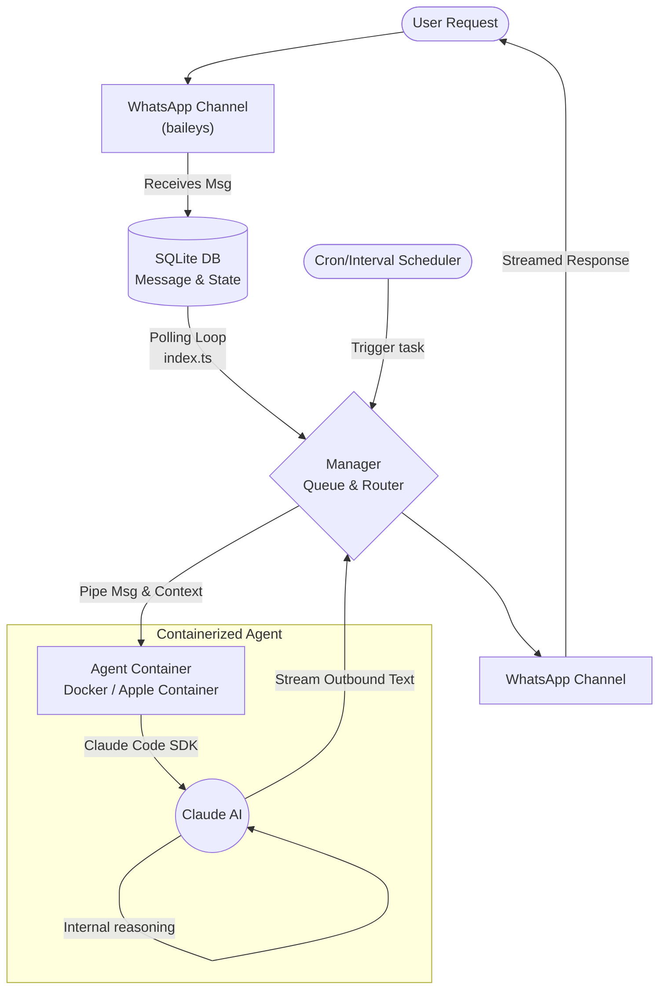

# Nanoclaw Project Analysis & Plan

이 문서는 Nanoclaw 프로젝트의 구조와 동작 방식을 이해하기 위해 분석된 전체 요약본과 분석 계획을 담고 있습니다.

## 1. 프로젝트 분석 계획

본 프로젝트 분석은 아래의 핵심 항목들을 파악하여 `docs-gabriel` 디렉토리에 지식 문서를 구축하는 것을 목표로 합니다.

- **목표**: Nanoclaw의 전반적인 기술 스택, 아키텍처 패턴, 모듈별 역할, 진입점 및 주요 로직 흐름을 명확히 정의
- **분석 대상 항목**:
  1. **기술 스택 (Tech Stack)**: 구동 환경, 개발 언어, 핵심 라이브러리 및 의존성
  2. **아키텍처 패턴 (Architecture Patterns)**: 시스템의 전반적인 구조와 디자인 원칙 (예: 컨테이너 격리, 메신저 연동 등)
  3. **계층적 역할 (Hierarchical Roles)**: 주요 모듈 및 파일들이 시스템 내에서 담당하는 역할 분담
  4. **중요 진입점 (Entry Points)**: 애플리케이션 시작 지점 및 외부 이벤트(메시지 수신 등) 시작점
  5. **요청 처리 생명주기 및 로직 흐름 (Logic Flow)**: 시스템이 외부 요청을 받아 AI 에이전트와 통신하고 결과를 반환하는 전체 과정
- **결과물 저장 위치**: 해당 문서(`d:\01_PRJ\nanoclaw\docs-gabriel\project_analysis.md`)에 내용을 최신화하여 관리.

---

## 2. 프로젝트 분석 결과

### 기술 스택 (Tech Stack)
- **런타임**: Node.js (v20 이상)
- **언어**: TypeScript
- **AI 연동**: Claude Agent SDK (Claude Code 기반)
- **컨테이너/샌드박스 격리**: Docker (macOS/Linux 호환) 또는 Apple Container (macOS 네이티브) 활용
- **데이터베이스**: SQLite (`better-sqlite3` 패키지 사용)
- **메신저 채널**: 현재 WhatsApp(`@whiskeysockets/baileys`) 기본 지원 (기타 채널은 스킬을 통해 확장)

### 아키텍처 패턴 (Architecture Patterns)
**"단일 프로세스 + 보안 격리된 컨테이너 에이전트"** 


- **단일 프로세스 오케스트레이션**: 상태 관리, 메시징 소켓, DB I/O, 스케줄링이 별도의 마이크로서비스가 아닌 하나의 Node.js 프로세스 내에서 동작하여 설정 복잡도를 매우 낮춤("Small enough to understand").
- **명시적 파일시스템 마운트 격리 (Secure by Isolation)**: 각 에이전트 그룹(채팅방)별로 격리된 파일시스템만을 컨테이너에 마운트하여 실행(Host의 Bash 권한 및 글로벌 파일 접근 방지).
- **플러그인 형태가 아닌 코드 변형 (Skills over features)**: 새로운 기능(예: Telegram 지원) 확장을 위해 설정 파일을 추가하는 방식이 아닌, Claude Code가 직접 코드를 변형(Customization = code changes)하는 형태.

### 시스템의 계층적 역할 (Hierarchical Roles)
Nanoclaw 시스템은 명확히 다음과 같이 역할을 분담합니다.

1. **오케스트레이터 및 핵심 루프 (`src/index.ts`)**: 
   - 전반적인 시스템 초기화(DB 로드, 상태 복구, 메신저 채널 시작, 스케줄러 등록 등)를 수행 후 무한 루프(`startMessageLoop`)를 돌며 새로운 메시지 감지.
2. **인바운드 채널 통신 (`src/channels/whatsapp.ts` 및 `Channel` 인터페이스)**:
   - 외부(WhatsApp)와 연결하여 송수신을 담당하며 `onMessage` 콜백을 통해 DB에 메시지 적재.
3. **데이터 퍼시스턴스 (`src/db.ts`)**:
   - 메시지 이력, 폴링 시간, 등록된 그룹(Session)과 Task 등에 대한 상태를 영구적으로 저장 및 제공 (SQLite).
4. **접속/큐 매니저 (`src/group-queue.ts`)**:
   - 그룹별로 메시지가 순차 처리되도록 동시성 제어 및 메시지가 활성화된 컨테이너에 파이프라인으로 연결되도록 조정.
5. **AI 에이전트 컨테이너 러너 (`src/container-runner.ts`, `src/container-runtime.ts`)**:
   - Claude AI를 샌드박스 단위로 실행 및 프로세스 관리. Host 파일 시스템 디렉토리 매핑과 IPC 통신 관할.
6. **예약 작업 처리 (`src/task-scheduler.ts`)**:
   - 스케줄링된 Cron, Interval 작업을 감시하고 트리거 발생시 관련 에이전트를 가동시키는 백그라운드 기능.

### 중요 진입점 (Entry Points)
- **어플리케이션 진입로**: `src/index.ts` 의 `main()` 함수.
- **메시지 감지 진입로**: 
  1. 외부 메시지는 `channels` 구현체(WhatsApp)에서 이벤트를 수신받아 데이터베이스(`storeMessage`)에 저장.
  2. `index.ts`의 `startMessageLoop` 안의 `getNewMessages` 호출 부분 주기적으로 새 이벤트를 찾아내 시스템 내부로 유입시킴.

### 중요 요청 처리 및 로직 흐름 (Logic Flow)
애플리케이션이 사용자 메시지를 수신하여 응답에 이르기까지의 과정입니다.
1. **수신 및 적재 (Ingestion)**: 
   - 사용자가 트리거어(예: `@Andy`)를 포함해 메시지를 보내면 `WhatsAppChannel`에서 수신 후 SQLite DB에 적재.
2. **폴링 아키텍처 (Polling loop)**:
   - `startMessageLoop()` 가 지정된 간격(`POLL_INTERVAL`)으로 DB에서 처리되지 않은 메시지를 가져와 그룹별로 묶음(Deduplicate).
3. **큐 라우팅 (Routing & Queueing)**:
   - 그룹 메시지가 유효성(트리거 판별 등)을 통과하면 `queue.sendMessage()` 혹은 `queue.enqueueMessageCheck()`를 거쳐 큐에 추가됨.
4. **에이전트 구동 (Execution / Container isolation)**:
   - `processGroupMessages()` 함수가 호출되어 `runAgent()` 를 실행.
   - 격리된 Docker/Apple Container 안에서 해당 그룹의 폴더 컨텍스트를 마운팅한 뒤 Claude SDK 에이전트 런타임이 실행.
5. **스트리밍 응답 (Outbound Streaming)**:
   - Agent가 생성해내는 내부 추론(`internal`) 부분은 제외(`replace`)하고 실제 발화할 텍스트 부분을 가로채서 `channel.sendMessage(chatJid, text)` 로 사용자에게 실시간 답변 송출.

---

## 3. 설치 및 실행 방법 (Quick Start)

원스텝(Setup) 스크립트 기반으로 초기 설치를 자동화합니다. 실행 환경으로는 macOS나 Linux, Node.js 20+, Docker(또는 Apple Container)와 Claude Code 가 설치되어 있어야만 합니다.

### 1) 필수 환경 설치
시스템에 기본 의존성 프로그램이 설치되어 있어야 합니다.

1. **Node.js (v20 이상)**
   - Node.js 공식 홈페이지에서 LTS 버전을 다운로드하거나 `nvm`을 통해 설치합니다.
2. **Docker 설치 및 실행** 
   - [Docker Desktop 공식 사이트](https://docker.com/products/docker-desktop)에서 OS에 맞는 버전을 다운로드하여 설치합니다.
   - **Windows / macOS**:
     1. 설치된 Docker Desktop 앱을 실행합니다.
     2. 설정 단계(튜토리얼 등)를 마치고 메인 창이 열리면 상태 표시줄이나 트레이 아이콘에 Docker 고래 로고 모양이 'Running' 인지 확인합니다. (Windows의 경우 WSL2 활성화 필요 시 안내에 따라 설정)
   - **Linux**:
     1. 터미널을 열고 스크립트를 통해 설치합니다: `curl -fsSL https://get.docker.com -o get-docker.sh && sudo sh get-docker.sh`
     2. Docker 서비스 시작: `sudo systemctl start docker` (부팅 시 자동 시작: `sudo systemctl enable docker`)
     3. 현재 사용자를 docker 그룹에 추가 (루트 없이 사용): `sudo usermod -aG docker $USER` (후에 터미널 재시작 필요)
   - **설치 확인**: 터미널에 `docker --version`을 입력하여 버전 정보가 정상적으로 출력되는지 확인하세요.
     - macOS의 경우 선택적으로 [Apple Container](https://github.com/apple/container)를 적용할 수도 있습니다.
3. **Claude Code 설치**
   - 글로벌 패키지로 Claude Code CLI를 설치 및 인증합니다. 
   - `npm install -g @anthropic-ai/claude-code`

### 2) 클론 및 초기 구동 설정

```bash
# 저장소 복제
git clone https://github.com/qwibitai/NanoClaw.git
cd NanoClaw

# Claude Code 셸 진입
claude
```
- claude 내에서 `/setup` 을 실행하면 Claude Code 가 **프로그램 의존성 셋업, 인증(로그인), 컨테이너 설정 및 서비스 세팅**을 모두 자동으로 지원 및 가이드해 줍니다. 
- 추후 커스텀 기능이 필요한 경우(ex. 텔레그램 연동, 동작 변경 등) 프로젝트 폴더 구조나 설정 파일을 직접 복잡하게 건드리는 대신 `claude` 내부에서 바로 자연어로 요구하거나 `/customize` 또는 개별 `/add-[skill명]` 명령을 통해 확장합니다.

### 3) 호스트(Host)와 컨테이너(Docker)의 분리 실행 구조 이해 (선택)

사용자들이 흔히 헷갈리기 쉬운 NanoClaw의 실행 구조는 다음과 같습니다. 질문하신 **"Docker 내부의 NanoClaw에서 Claude를 실행하는 건가?"**에 대한 대답은 **"호스트와 도커 각각 목적이 다르게 실행된다"**입니다. 이 프로젝트는 **(1) 호스트에서 설정 및 메인 서버 가동**을 하고, **(2) 도커 내부에서 격리된 에이전트(Claude)만 일회성 실행**하는 이원화된 구조를 가집니다.

1. **설정/커스텀 및 메인 서버 구동은 호스트(사용자 PC)에서 수행**
   - 앞서 `cd NanoClaw` 후 터미널에서 `claude` 명령을 입력하여 실행하는 것은 **호스트 PC**에 글로벌로 설치한 Claude Code(`npm install -g ...`)입니다.
   - 여기서 `/setup`이나 `/customize`를 입력하면 호스트 환경의 스크립트가 돌아가며 Docker 이미지를 대신 빌드(`docker build`)해주고, Node.js 패키지 등을 세팅해 줍니다. 
   - 즉, 메시지를 감지하고 큐잉하는 NanoClaw 메인 애플리케이션(오케스트레이터, `npm run start`)도 도커 내부가 아닌 **호스트에서 구동**됩니다.

2. **개별 채팅 에이전트 처리만 컨테이너(Docker) 내부에서 수행**
   - 호스트 메인 서버가 사용자로부터 실제 WhatsApp 메시지를 수신하게 되면, 샌드박스 보안 격리를 위해 메인 서버(`src/container-runner.ts`)가 백그라운드에서 `docker run --rm -i ... nanoclaw-agent:latest` 명령을 호출합니다.
   - 이때 이 일회성 컨테이너 이미지(`container/Dockerfile`) 안에는 **컨테이너용으로 다시 설치된 Claude Code** 패키지가 들어있습니다.
   - 최종적으로, 해당 채팅방 그룹에 배정된 특정 폴더 컨텍스트(예: `CLAUDE.md`)만 호스트에서 컨테이너 안으로 마운트(`-v`)되며, 격리된 도커 환경 속의 Claude AI 컨테이너가 요청에 대한 추론 및 답변 처리를 마친 뒤 컨테이너가 깔끔하게 종료되는 구조입니다.

   **Q. 도커 컨테이너에서 동작하는 Claude Code는 어떻게 인증/연결(API 접속)을 수행하나요?**
   - 컨테이너 내부의 Claude Code 역시 통신을 위해 인증 정보(OAuth 토큰이나 `ANTHROPIC_API_KEY`)가 필요합니다. 하지만 보안을 위해 이 인증 정보를 컨테이너 안의 파일 시스템에 영구 보관(`-v` 마운트 등)하지 않습니다. 
   - 대신 호스트의 메인 애플리케이션이 `.env`에서 키를 읽어들인 뒤, **`docker run`을 실행할 때 표준 입력(`stdin`) 스트림을 통해 JSON 형태로 컨테이너 내부에 직접 주입(Pass via stdin)**합니다. 
   - 컨테이너는 이 입력값을 메모리에서 바로 읽어 Claude API 요청을 보내는 구조로 동작하므로 만약 컨테이너가 침해당하더라도 파일에 하드코딩된 API Key가 유출될 환경적 위험성을 없앴습니다.

   **Q. 그럼 Claude Code가 읽거나 수정해야 하는 코드나 문서는 어떻게 연결하나요?**
   - 컨테이너는 기본적으로 호스트 PC의 파일 시스템에 접근할 수 없도록 고립(Sandboxing)되어 있습니다.
   - 하지만 에이전트가 코드를 분석하거나 문서를 읽기 위해선 **호스트의 특정 폴더를 컨테이너 내부로 마운트(`-v` 즉, 볼륨 바인딩)해주는 방식**을 사용합니다.
     - **일반 채팅방(비관리자)**: 해당 채팅방에 할당된 제한된 그룹 폴더(`.nanoclaw/groups/[방이름]`)만 지정해서 마운트하므로, 다른 채팅방이나 호스트 PC의 코어 로직은 전혀 볼 수 없습니다.
     - **메인(Main) 관리자 채널**: 사용자와 봇만이 있는 1:1 채널에서는 NanoClaw 프로젝트 전체 폴더가 **읽기 전용(Read-Only)** 등으로 깊게 마운트되며, 부가 문서 등에도 접근 가능하도록 열립니다.
     - **추가 마운트 허용 (Additional Mounts)**: 필요 시 `groupConfig`를 통해 관리자가 별도로 특정 Host의 경로(ex. 내 문서나 Obsidian 폴더 등)를 추가로 마운트 지정해주어 접근하게 만들 수 있습니다.

---
*해당 문서는 Nanoclaw 프로젝트 구조가 업데이트되거나 새로운 Skill이 적용될 때마다 지속적으로 추가 및 최신화할 수 있습니다.*
