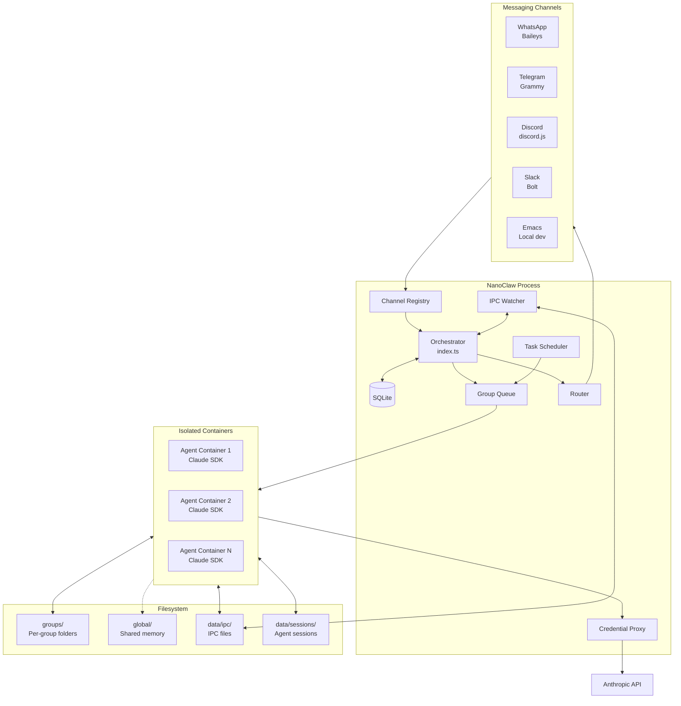
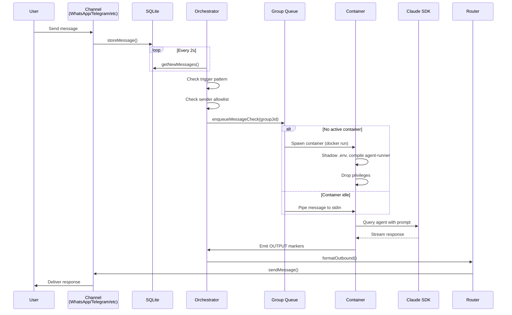
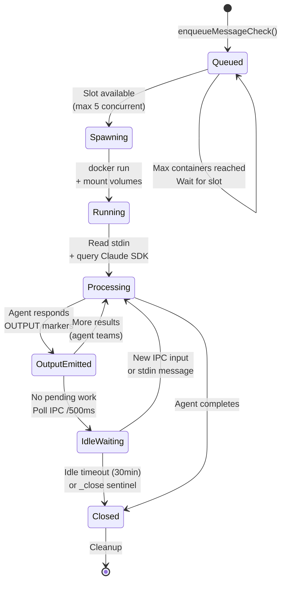
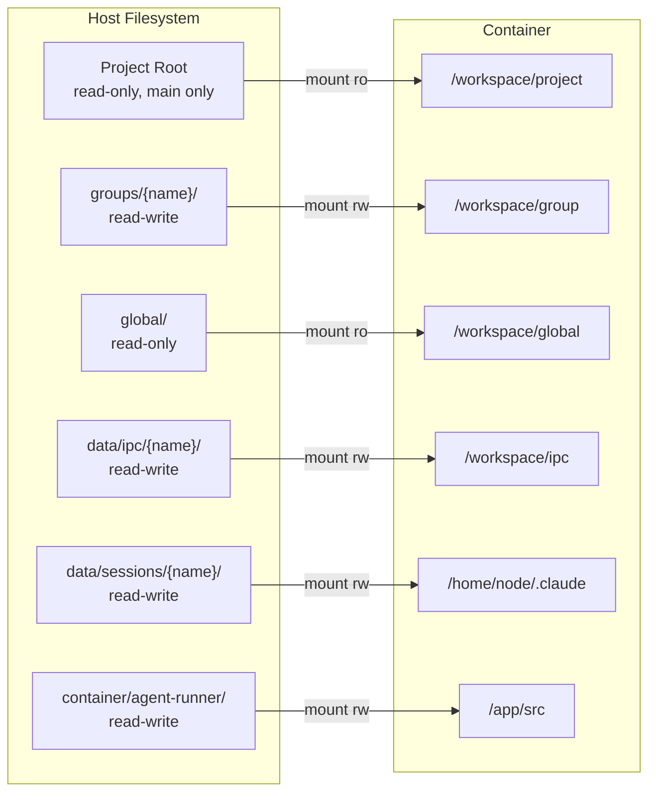
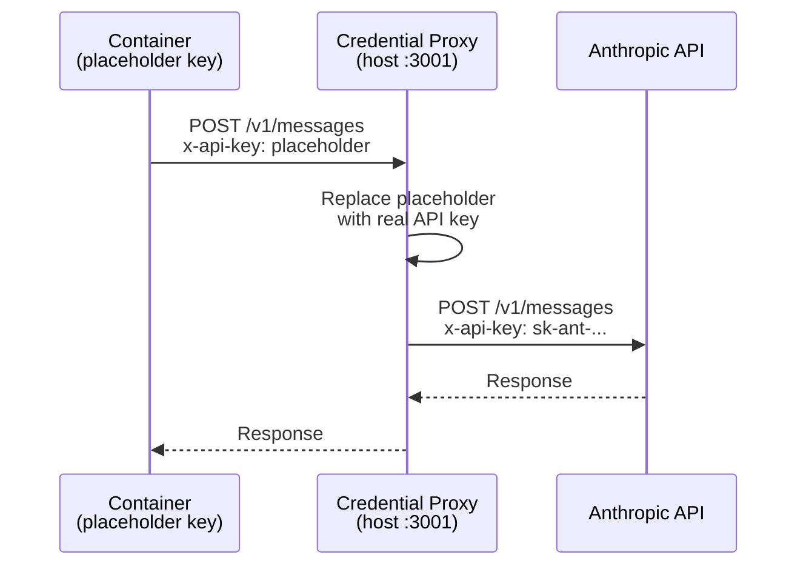
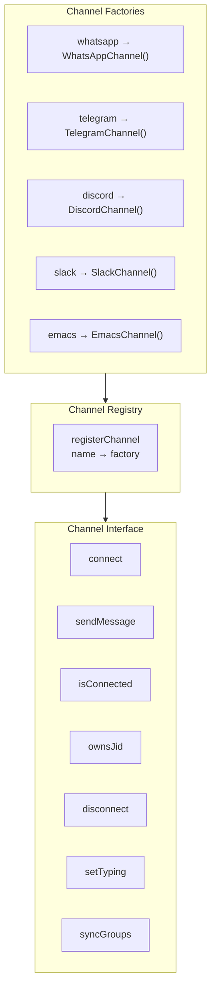
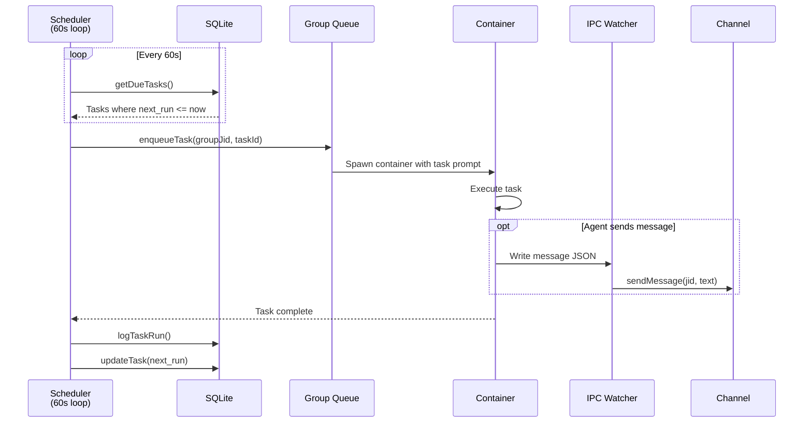
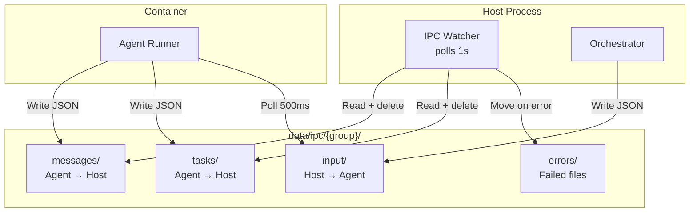
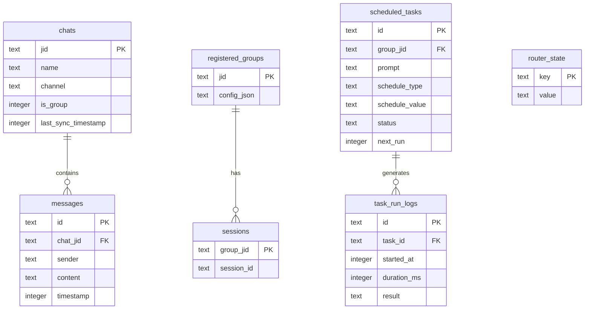

# NanoClaw Architecture

Living architecture documentation. Last updated: March 27, 2026.

---

## System Overview

NanoClaw is a single Node.js process that orchestrates messaging channels, routes messages to Claude agents running in isolated Linux containers, and manages scheduled tasks. Security is achieved through OS-level container isolation, not application-level permissions.

---

## Message Flow

From user message to agent response:

---

## Container Lifecycle

Each container runs an isolated Claude agent with its own filesystem, memory, and IPC namespace:

---

## Container Mount Architecture

---

## Credential Security

Secrets never enter containers directly. A proxy intercepts API calls at the network boundary:

---

## Channel System

Channels self-register at startup via a factory pattern:

Each channel implements the `Channel` interface and provides two callbacks: `onMessage` for inbound messages and `onChatMetadata` for group discovery.

---

## Scheduled Tasks

---

## IPC System

Bidirectional communication between host and containers via filesystem:

**Authorization:** Main group can send to any JID and manage any task. Non-main groups are restricted to their own JID and tasks.

---

## Database Schema

---

## Key Configuration

| Setting | Default | Purpose |
|---------|---------|---------|
| `ASSISTANT_NAME` | `@Andy` | Trigger word prefix |
| `POLL_INTERVAL` | 2000ms | Message polling frequency |
| `CONTAINER_TIMEOUT` | 1800s | Max container runtime |
| `IDLE_TIMEOUT` | 1800s | Keep idle container alive |
| `MAX_CONCURRENT_CONTAINERS` | 5 | Concurrency limit |
| `IPC_POLL_INTERVAL` | 1000ms | IPC file check frequency |
| `SCHEDULER_POLL_INTERVAL` | 60000ms | Task scheduler check |

---

## File Map

| File | Purpose |
|------|---------|
| `src/index.ts` | Orchestrator: state, message loop, agent invocation |
| `src/db.ts` | SQLite schema and queries |
| `src/container-runner.ts` | Spawn containers with mounts |
| `src/container-runtime.ts` | Runtime abstraction (Apple Container/Docker/Podman) |
| `src/credential-proxy.ts` | Secure credential injection proxy |
| `src/group-queue.ts` | Per-group concurrency control |
| `src/task-scheduler.ts` | Scheduled task execution |
| `src/ipc.ts` | Host-container IPC watcher |
| `src/router.ts` | Message formatting and channel lookup |
| `src/config.ts` | Environment-driven configuration |
| `src/types.ts` | Core interfaces |
| `src/channels/registry.ts` | Channel factory pattern |
| `src/channels/*.ts` | Channel implementations |
| `container/Dockerfile` | Agent container image |
| `container/agent-runner/` | Container entrypoint and agent SDK wrapper |
