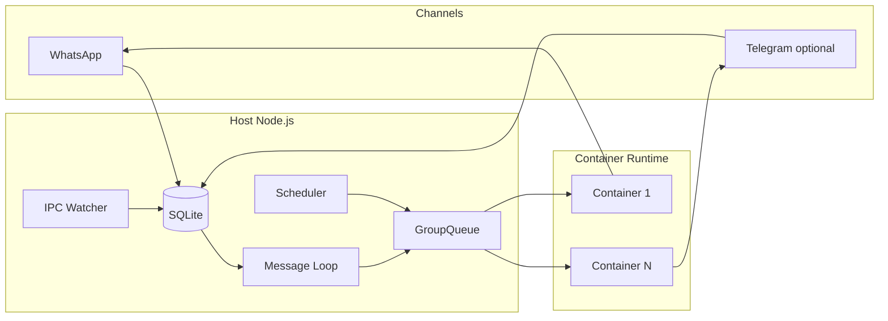
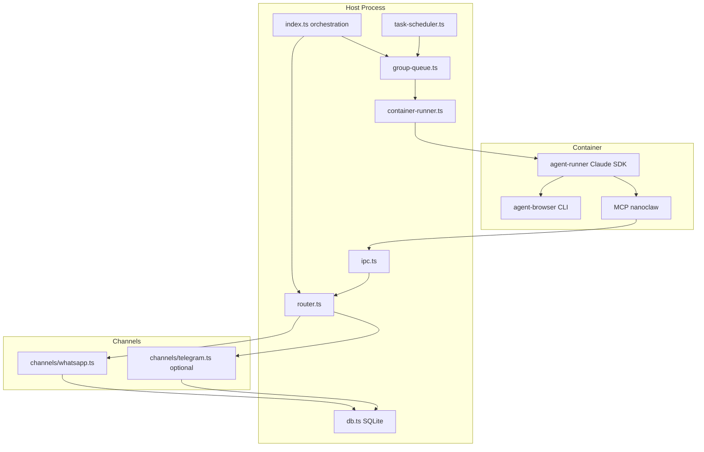

# NanoClaw Architecture

## High-level flow

**One Node.js process** on the host. Messages from channels (WhatsApp by default; Telegram if added via `/add-telegram`) are stored in SQLite. A polling loop reads new messages, a **GroupQueue** enforces per-group ordering and a global concurrency limit, and each "turn" runs the agent in an **isolated container**. The agent uses the **Claude Agent SDK** (Claude Code) inside the container; its replies are streamed back and sent out via the same channel that received the message.

---

## 1. Channels (WhatsApp, optional Telegram)

- **Abstraction**: All channels implement the [Channel](src/types.ts) interface: `connect()`, `sendMessage(jid, text)`, `isConnected()`, `ownsJid(jid)`, `disconnect()`, optional `setTyping()`.
- **WhatsApp**: Implemented in [src/channels/whatsapp.ts](src/channels/whatsapp.ts) using **Baileys**. Connects to WhatsApp Web, persists auth under `store/auth`, writes incoming messages to SQLite via `onMessage`, and sends from an outgoing queue. JIDs are WhatsApp IDs (e.g. `123@g.us`).
- **Telegram**: Not in the base repo; added by the **add-telegram** skill. It adds `src/channels/telegram.ts` (e.g. Grammy bot), merges it into [src/index.ts](src/index.ts) so the orchestrator pushes **TelegramChannel** into the `channels` array. Telegram JIDs use a `tg:` prefix; DB can store `channel = 'telegram'` for chats. Routing is channel-agnostic: **router** uses `findChannel(channels, jid)` to pick the channel that `ownsJid(jid)` and then that channel sends the reply.
- **Routing**: [src/router.ts](src/router.ts) formats inbound messages as XML and outbound as plain text (strips `<internal>` blocks). No channel-specific logic there—only "which channel owns this JID?"

---

## 2. Message flow and state

- **Storage**: [src/db.ts](src/db.ts) — SQLite in `data/` with `chats`, `messages`, `sessions`, `router_state`, `registered_groups`, `scheduled_tasks`, `task_run_logs`.
- **Registration**: Groups (or Telegram chats) are registered from the **main** channel (e.g. "join Family Chat"). Each registration has: `jid`, `name`, `folder` (e.g. `main`, `family-chat`), `trigger` pattern, optional `containerConfig` (extra mounts). Stored in `registered_groups` and in-memory `registeredGroups` in [src/index.ts](src/index.ts).
- **Main channel**: The "admin" chat (e.g. self-chat). It can register groups, schedule tasks for any group, and write global memory; other groups only see their own folder and can only schedule for themselves.
- **Trigger**: For non-main groups, the agent is invoked only when a message matches the trigger (default `@Andy`). [src/config.ts](src/config.ts) exposes `TRIGGER_PATTERN`; main group does not require a trigger.
- **Message loop** ([src/index.ts](src/index.ts) `startMessageLoop`): Polls `getNewMessages(jids, lastTimestamp, ASSISTANT_NAME)` every `POLL_INTERVAL` (2s). Advances `lastTimestamp`, deduplicates by group. If the group has a trigger, only trigger messages cause work; when they do, it pulls *all* messages since `lastAgentTimestamp` for context. Then either:
  - **Pipes** the formatted messages into an already-running container for that group (if one is active), or
  - **Enqueues** a message check via **GroupQueue** so a new container will be spawned and get the messages.

---

## 3. GroupQueue and concurrency

- [src/group-queue.ts](src/group-queue.ts): **Per-group** queue plus **global** concurrency limit (`MAX_CONCURRENT_CONTAINERS`, default 5).
- For each group: at most one active container; "pending messages" and "pending tasks" queues. If the group already has an active container, new messages are either piped to it (message path) or appended to pending tasks (scheduler path). If at concurrency limit, the group is put in `waitingGroups` until a slot frees.
- When it's a group's turn, the queue calls `processMessagesFn(groupJid)` → `processGroupMessages(chatJid)` in index, which loads missed messages, formats them, advances `lastAgentTimestamp`, and calls **runAgent** (which calls **container-runner**). Streaming output from the container is forwarded to the channel (`channel.sendMessage`); on error, the cursor is rolled back for retry (unless some output was already sent).

---

## 4. Containers and agent execution

- **Spawning**: [src/container-runner.ts](src/container-runner.ts) builds volume mounts per group, then runs the container image (e.g. `nanoclaw-agent:latest`) via **Docker or Apple Container** ([src/container-runtime.js](src/container-runtime.js)). Input is a single JSON blob written to stdin (prompt, sessionId, groupFolder, chatJid, isMain, assistantName, secrets, model). No secrets on disk or in mounts.
- **Mounts** (summary):
  - **Main group**: project root → `/workspace/project` (read-only), main group folder → `/workspace/group` (rw).
  - **Other groups**: only that group's folder → `/workspace/group` (rw), plus optional `groups/global` → `/workspace/global` (ro).
  - Per-group: `data/sessions/{group}/.claude/` → `/home/node/.claude` (skills, settings), **container/skills/** synced into each group's session skills; per-group IPC dir → `/workspace/ipc`; optional **additionalMounts** validated against [mount allowlist](src/mount-security.ts) (`~/.config/nanoclaw/mount-allowlist.json`).
- **Inside the container**: [container/agent-runner/src/index.ts](container/agent-runner/src/index.ts) reads stdin, then runs a **query loop** using **@anthropic-ai/claude-agent-sdk** `query()`. It passes project dir `/workspace/group`, optional session resume, and a **MessageStream** that is fed by polling `/workspace/ipc/input/` for new JSON message files (and `_close` sentinel). Each agent result is printed with `---NANOCLAW_OUTPUT_START---` / `---NANOCLAW_OUTPUT_END---`; the host parses these and forwards to the channel. Session IDs are persisted so the next run can resume.
- **Tools available in container**: Bash (sandboxed in container), Read/Write/Edit/Glob/Grep, WebSearch/WebFetch, **agent-browser** (see below), and **nanoclaw MCP** (schedule_task, list_tasks, send_message, etc.) over stdio to the host.

---

## 5. IPC (host ↔ container)

- **File-based**: [src/ipc.ts](src/ipc.ts) watches `data/ipc/{groupFolder}/messages/` and `.../tasks/`. No shared process: the host polls these dirs; containers write into their **own** `/workspace/ipc` (which is the host's `data/ipc/{groupFolder}/`).
- **Outbound (container → host)**:
  - **Send message**: Container (via MCP) writes a JSON file under `.../messages/` with `type: 'message', chatJid, text`. Host's IPC watcher picks it up, checks authorization (main can send to any registered JID; others only to their own group), then calls `sendMessage(jid, text)` on the channel that owns `jid`.
  - **Tasks**: Container writes JSON to `.../tasks/` for `schedule_task`, `register_group`, etc. Host's `processTaskIpc` applies auth (e.g. only main can register groups or schedule for other groups) and updates DB / snapshots.
- **Inbound (host → container)**: Host doesn't write into the same IPC dir for "new user message" — that's handled by the message loop: either a new container is started with the initial prompt on stdin, or a running container gets follow-up messages via the **piping** path (host writes into the container's stdin / input mechanism as implemented in the runner). The runner's **MessageStream** is fed by the container polling `/workspace/ipc/input/` for JSON files (and the host writing those when piping).

---

## 6. Scheduler

- [src/task-scheduler.ts](src/task-scheduler.ts): Loop every `SCHEDULER_POLL_INTERVAL` (60s), calls `getDueTasks()`, and for each due task enqueues it on the **GroupQueue** (same queue as messages). Task runs in the same container pattern: `runContainerAgent` with `isScheduledTask`, group context, and session if `context_mode === 'group'`. After the run, the container can have called `send_message` (via MCP) to post back to the group; the host uses `findChannel(channels, jid)` and that channel's `sendMessage`. So scheduled tasks can send replies over **Telegram or WhatsApp** depending on which channel owns the task's `chat_jid`.

---

## 7. Browser automation (agent-browser)

- **Where it runs**: Inside the container. The container image ([container/Dockerfile](container/Dockerfile)) installs **agent-browser** and **claude-code** globally; [container/skills/agent-browser/SKILL.md](container/skills/agent-browser/SKILL.md) is synced into each group's `.claude/skills/` so every agent run can use it.
- **How it's used**: The agent uses **Bash** to run `agent-browser` CLI (e.g. `agent-browser open <url>`, `agent-browser snapshot -i`, `agent-browser click @e1`). Chromium runs inside the container; no host browser is involved for this path. So "browser automation" here is container-scoped, snapshot/element-ref based, and available to all groups that get the default container skills.
- **Output capture**: When each `agent-browser` call runs in a separate Bash invocation, stdout/stderr from commands like `get title` or `snapshot` can be lost (buffering or SDK capture). The skill doc instructs chaining open + get in one Bash call and using `2>&1`; the container's [PreToolUse Bash hook](container/agent-runner/src/index.ts) automatically appends `2>&1` to `agent-browser get` and `agent-browser snapshot` commands so stderr is merged into stdout.

---

## 8. Telegram in this architecture

- **Adding Telegram**: The **add-telegram** skill adds a second channel. At runtime, [src/index.ts](src/index.ts) does `channels.push(whatsapp)` and, if present, `channels.push(telegram)` (or similar). All orchestration (DB, queue, router, IPC, scheduler) is already channel-agnostic: they work with `jid` and `findChannel(channels, jid)`. So "communication over Telegram" is: Telegram channel receives message → stored in SQLite with `chat_jid` like `tg:...` and optional `channel = 'telegram'` → message loop and queue treat it like any other group → container runs and may call `send_message` → IPC watcher sends via `channel.sendMessage(jid, text)` → Telegram channel sends to that chat.
- **Control-only / passive**: The skill can configure Telegram as "control-only" (only triggers, no notifications) or "passive" (only receives) by how the Telegram channel is registered and whether replies are sent; the core architecture doesn't change—only which channels exist and what they do with send.

---

## 9. Summary diagram (components)

---

## Key files (recap)

| Layer      | File                                                                               | Role                                                                                    |
| ---------- | ---------------------------------------------------------------------------------- | --------------------------------------------------------------------------------------- |
| Entry      | [src/index.ts](src/index.ts)                                                       | State, channel registration, message loop, runAgent, GroupQueue, scheduler & IPC wiring |
| Channels   | [src/channels/whatsapp.ts](src/channels/whatsapp.ts)                               | WhatsApp I/O (Telegram added by skill)                                                  |
| Routing    | [src/router.ts](src/router.ts)                                                     | formatMessages, formatOutbound, findChannel                                             |
| Config     | [src/config.ts](src/config.ts)                                                     | ASSISTANT_NAME, TRIGGER_PATTERN, paths, concurrency, timeouts                          |
| Queue      | [src/group-queue.ts](src/group-queue.ts)                                           | Per-group queue, global concurrency, pipe vs enqueue                                    |
| Containers | [src/container-runner.ts](src/container-runner.ts)                                 | Mounts, spawn, stdin JSON, streamed output parsing                                      |
| Agent      | [container/agent-runner/src/index.ts](container/agent-runner/src/index.ts)         | Read stdin, query loop, IPC input poll, SDK query(), output markers                     |
| IPC        | [src/ipc.ts](src/ipc.ts)                                                           | Per-group dirs, message/task JSON processing, auth                                     |
| Scheduler  | [src/task-scheduler.ts](src/task-scheduler.ts)                                      | Due tasks, runContainerAgent, send_message to channel                                    |
| Browser    | [container/skills/agent-browser/SKILL.md](container/skills/agent-browser/SKILL.md) | Bash-driven agent-browser in container                                                  |

This is the full architecture: agents in containers, browser automation inside those containers, and communication over WhatsApp and/or Telegram via a single host process and channel-agnostic routing.
