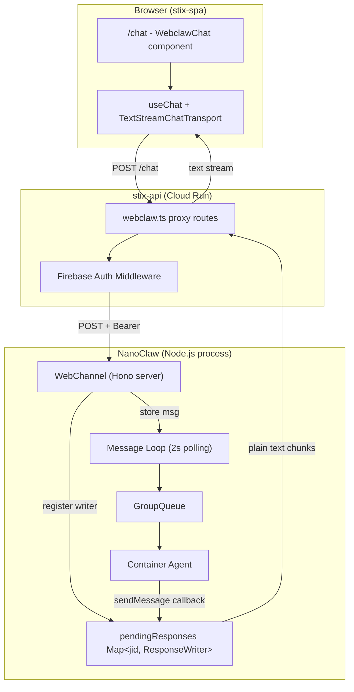
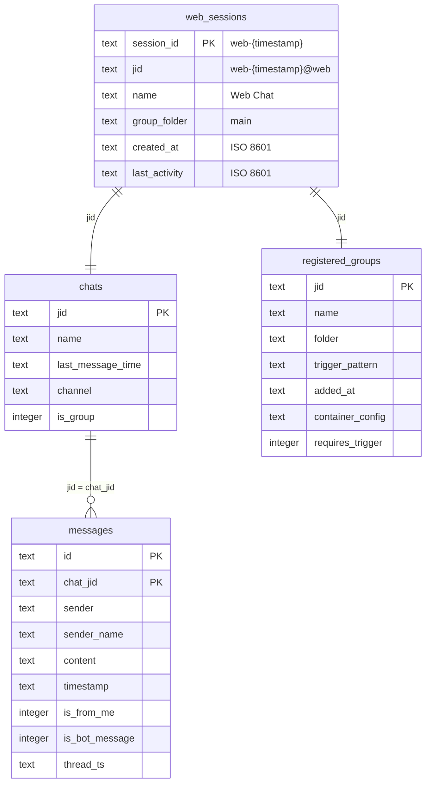

# WebClaw: Web Channel for NanoClaw + Chat UI in Stix

## Enhancement Summary

**Deepened on:** 2026-02-26
**Research agents used:** Hono best-practices, AI SDK framework-docs, TypeScript reviewer, Security sentinel, Performance oracle, Frontend race-conditions reviewer, Architecture strategist, Code simplicity reviewer, Pattern recognition specialist, Data integrity guardian

### Key Improvements Discovered

1. **Bypass the 2-second polling loop** — Web messages should call `queue.enqueueMessageCheck()` directly, eliminating 0-2s of dead latency per message (avg 1s saved)
2. **Serialize writeSmooth with writeQueue** — Without serialization, concurrent `sendMessage()` calls interleave word-by-word output, producing garbled text
3. **Use random session IDs** — `web-{timestamp}` has millisecond collision risk under concurrent requests. Use `web-{timestamp}-{crypto.randomUUID().slice(0,8)}`
4. **Enable SQLite WAL mode** — The main database doesn't set WAL. Adding `PRAGMA journal_mode = WAL` provides 2-5x write throughput and eliminates reader/writer blocking. Benefits ALL channels
5. **Use `prepareSendMessagesRequest`** — `TextStreamChatTransport` sends the entire `UIMessage[]` array on every request. Use this option to send only the last user message, keeping payloads small
6. **Use Hono `streamText()` helper** — Instead of manual `TransformStream`, use Hono's built-in `streamText()` which sets correct headers and handles lifecycle automatically
7. **Configure Node.js server timeouts** — Default `requestTimeout` is 300s (5 min). Must be raised for long agent runs. Set `keepAliveTimeout` to avoid proxy disconnects
8. **Wrap session creation in `db.transaction()`** — Three coordinated table writes (web_sessions, chats, registered_groups) must be atomic to prevent partial session creation
9. **Add composite index** — `messages(chat_jid, timestamp)` — transforms history endpoint from full table scan to direct range scan

### New Risks Discovered

| Risk | Severity | Source | Mitigation |
|------|----------|--------|------------|
| writeSmooth concurrent-writer garble | CRITICAL | Race conditions review | Add `writeQueue: Promise<void>` to serialize writes |
| setTyping(false) truncates in-flight writeSmooth | CRITICAL | Race conditions review | `setTyping` must await `writeQueue` before closing |
| Predictable session IDs enable enumeration | CRITICAL | Security review | Use `crypto.randomUUID()` suffix |
| No WAL mode on SQLite | HIGH | Performance + Data integrity | Add `PRAGMA journal_mode = WAL` to `initDatabase()` |
| Session switch doesn't abort active stream | HIGH | Race conditions review | `useEffect` cleanup calls `stop()` on unmount/session change |
| History hydration can overwrite in-flight message | MEDIUM | Race conditions review | Disable input until hydration complete |
| Container error produces silent truncation | MEDIUM | Race conditions review | Write in-band error text before closing stream |
| senderName injection → agent prompt injection | HIGH | Security review | Validate pattern, reject if matches ASSISTANT_NAME |
| WEB_AUTH_TOKEN not in `readEnvFile()` array | HIGH | TypeScript review | Must add to the readEnvFile call in index.ts |

---

## Overview

Add an HTTP channel to NanoClaw so a separately-hosted web frontend (Stix SPA) can send messages and receive streamed agent responses. This is a two-project feature:

1. **NanoClaw** — New `web` channel (`src/channels/web.ts`) implementing the `Channel` interface with a Hono HTTP server and streaming text responses

Location: `~/workspace/dalab/nanoclaw` directory

2. **Stix** — API proxy routes in stix-api + standalone full-screen chat UI in stix-spa at `/chat` using Vercel AI SDK's `useChat` hook for smooth streaming UX

Location: `~/workspace/dalab/stix` directory

The web channel joins WhatsApp, Slack, and GitHub as the fourth NanoClaw channel. The Stix integration follows the proxy pattern: browser authenticates with Firebase, stix-api validates and forwards to NanoClaw with `WEB_AUTH_TOKEN`.

## Problem Statement / Motivation

NanoClaw's agent capabilities are currently locked behind WhatsApp, Slack, and GitHub. There is no web-based interface for:

- Quick ad-hoc agent conversations without messaging app context
- Programmatic integration by web apps
- Users who don't use WhatsApp/Slack

A web channel unlocks the agent for any HTTP-capable client and provides a clean chat experience in the Stix platform.

## Proposed Solution

### Architecture

```
Browser (stix-spa)
  ├── POST /api/webclaw/sessions              ──► stix-api ──► NanoClaw POST /api/sessions
  ├── GET  /api/webclaw/sessions              ──► stix-api ──► NanoClaw GET /api/sessions
  ├── GET  /api/webclaw/sessions/:id/messages ──► stix-api ──► NanoClaw GET /api/sessions/:id/messages
  └── POST /api/webclaw/sessions/:id/chat     ──► stix-api ──► NanoClaw POST /api/sessions/:id/chat
       │          │                                                │
   useChat     Firebase auth                              Bearer token
   (TextStream) (ID token)                             (WEB_AUTH_TOKEN)
```

**Key design: `useChat` + `TextStreamChatTransport`**

The chat UI uses Vercel AI SDK's `useChat` hook with `TextStreamChatTransport`. This gives us:
- Smooth text streaming with `experimental_throttle`
- 4-state status machine: `ready` → `submitted` → `streaming` → `ready` (replaces typing indicators)
- Built-in abort (`stop()`), retry (`regenerate()`), optimistic UI
- No custom SSE parsing needed — `useChat` handles the text stream protocol

NanoClaw's chat endpoint returns a **plain text stream** (not SSE). The response is held open while the agent processes and streams output chunks as plain text. `setTyping(false)` closes the response.

**Why proxy through stix-api:**
- Keeps `WEB_AUTH_TOKEN` server-side (never exposed to browser)
- Leverages existing Firebase auth middleware
- Allows workspace-level access control in the future
- Consistent with stix-api's role as the API gateway

### Framework Choice: Hono

Evaluated in the [origin document](docs/plans/nano-claw-web-channel.md). Hono is the best fit:
- 14KB footprint (vs 2MB+ Express) — appropriate for a single-channel HTTP API
- TypeScript-first with `@hono/zod-validator` — matches NanoClaw's zod usage
- Node.js adapter (`@hono/node-server`) proven in production (stix-api already uses Hono)
- `streamSSE()` available if needed in future, but primary chat endpoint uses plain text streaming

### Streaming Design: Request-Response (Not SSE)

The original plan used a separate SSE endpoint (`GET /stream`). The new design uses `useChat`'s request-response model:

```
1. useChat sends POST /api/sessions/:id/chat  { content: "Help me..." }
2. NanoClaw stores message, triggers processing, holds response open
3. Message loop (2s poll) picks up message → GroupQueue → container
4. Container output → channel.sendMessage(jid, text) → writes plain text to response
5. Agent done → channel.setTyping(jid, false) → closes response
6. useChat transitions: submitted → streaming → ready
```

**Why this is better than SSE:**
- Simpler proxy (no dual-connection, no event framing — just pipe the response body)
- `useChat` manages all state (messages, status, abort, retry)
- The `submitted` status replaces the typing indicator
- No heartbeat needed — the connection is short-lived per message exchange

**Concurrency:** Each session has its own POST → response pair. Multiple sessions work independently. The bottleneck is `MAX_CONCURRENT_CONTAINERS` (5), not connections. Queued sessions stay in `submitted` status until a container slot opens. Within a single session, only one pending response is allowed (409 Conflict if a second POST arrives while processing).

**Body format bridge:** `TextStreamChatTransport` sends `{ messages: UIMessage[] }` (the full conversation). The stix-api proxy extracts the last user message text and forwards `{ content, senderName }` to NanoClaw. NanoClaw's web channel is stateful (maintains conversation context in the container's Claude session), so only the new message is needed.

### Research Insights: Streaming Architecture

**AI SDK Transport Findings (from framework docs research):**

- `TextStreamChatTransport` default body is `{ id, messages: UIMessage[], trigger, messageId }` — the FULL conversation grows with every exchange
- Use `prepareSendMessagesRequest` to send only the last user message, keeping payloads small:
  ```typescript
  transport: new TextStreamChatTransport({
    api: `/api/webclaw/sessions/${sessionId}/chat`,
    headers: async () => {
      const token = await auth.currentUser?.getIdToken(false); // auto-refreshes
      return { Authorization: `Bearer ${token}` };
    },
    prepareSendMessagesRequest({ messages }) {
      const lastUser = messages.filter(m => m.role === 'user').pop();
      const text = lastUser?.parts
        ?.filter(p => p.type === 'text')
        .map(p => p.text)
        .join('') ?? '';
      return { body: { content: text, senderName: 'User' } };
    },
  }),
  ```
  This eliminates the proxy's body format bridge entirely — NanoClaw receives `{ content, senderName }` directly.

- `headers` accepts an async function resolved fresh per request — perfect for Firebase token refresh. No need for a custom `fetch` wrapper
- `smoothStream` is server-side only (AI SDK core). Client-side equivalent is `experimental_throttle`
- Error responses must use HTTP status codes — no structured error protocol in plain text streams
- Messages use `parts` array (not `content` string). Render with `message.parts.map(p => p.type === 'text' ? p.text : null)`

**Hono Streaming Findings (from best-practices research):**

- **Use `streamText()` helper** instead of manual `TransformStream`. Sets correct headers (`Content-Type`, `Transfer-Encoding: chunked`, `X-Content-Type-Options: nosniff`) and handles lifecycle:
  ```typescript
  import { streamText } from 'hono/streaming';
  return streamText(c, async (stream) => {
    stream.onAbort(() => cleanup(jid));
    // ... hold open, write chunks via external reference
  });
  ```
- **Configure server timeouts** on the Node.js server returned by `serve()`:
  ```typescript
  const server = serve({ fetch: app.fetch, port });
  server.requestTimeout = 0;        // Disable (default 300s too low)
  server.keepAliveTimeout = 60_000;  // 60s (default 5s too low for streaming)
  ```
- **Add heartbeat writes** every 30 seconds to prevent proxy/load balancer idle timeouts:
  ```typescript
  const heartbeat = setInterval(() => stream.write('\n'), 30_000);
  stream.onAbort(() => clearInterval(heartbeat));
  ```
- **Middleware order must be:** CORS → bearerAuth → zValidator (inline per-route). CORS before auth so preflight OPTIONS aren't rejected with 401
- **Minimum versions:** `hono@^4.7.0`, `@hono/node-server@^1.13.0`
- **Share one `TextEncoder`** per process, not per connection

## Technical Approach

### Architecture

Two projects, four phases. NanoClaw changes are isolated to `src/channels/web.ts` + small touches to `src/index.ts`, `src/config.ts`, and `src/db.ts`. Stix changes add a new API route module and a standalone chat page.



### Implementation Phases

#### Phase 1: NanoClaw Web Channel Core

**Goal:** Working HTTP API with session management, message ingestion, and streamed text responses.

**Tasks:**

- [x] Install dependencies: `hono`, `@hono/node-server`, `@hono/zod-validator`
- [x] Add `web_sessions` table to `src/db.ts` for session persistence across restarts
- [x] Create `src/channels/web.ts` implementing the `Channel` interface
- [x] Add env config: `WEB_AUTH_TOKEN`, `WEB_API_PORT` (default 3100)
- [x] Register web channel in `src/index.ts` (conditional on `WEB_AUTH_TOKEN`)
- [x] Implement `POST /api/sessions/:id/chat` with held-open text stream response
- [x] Wire `sendMessage()` and `setTyping()` to the pending response writer
- [x] Implement smooth streaming in `sendMessage()`: buffer text, release word-by-word at 5ms intervals (adaptive chunking for long texts)
- [x] **[NEW]** Bypass polling loop: add `onDirectEnqueue` callback to web channel opts, call `queue.enqueueMessageCheck(jid)` directly after storing message (eliminates 0-2s latency)
- [x] **[NEW]** Enable SQLite WAL mode in `initDatabase()`: `db.pragma('journal_mode = WAL')` + `db.pragma('busy_timeout = 5000')`
- [x] **[NEW]** Add composite index: `CREATE INDEX IF NOT EXISTS idx_messages_chat_jid_ts ON messages(chat_jid, timestamp)`
- [x] **[NEW]** Use random session IDs: `web-${Date.now()}-${crypto.randomUUID().slice(0,8)}` (not `web-{timestamp}`)
- [x] **[NEW]** Wrap session creation in `db.transaction()` (atomic writes to web_sessions + chats + registered_groups)
- [x] **[NEW]** Serialize writes with `writeQueue: Promise<void>` in pendingResponses — prevents concurrent sendMessage garble
- [x] **[NEW]** Configure server timeouts: `server.requestTimeout = 0`, `server.keepAliveTimeout = 60_000`

**Key decisions embedded:**

| Decision | Choice | Rationale |
|----------|--------|-----------|
| Streaming model | Plain text stream response (not SSE) | Works with `useChat` + `TextStreamChatTransport`. Simpler proxy, no event framing |
| Session persistence | New `web_sessions` SQLite table | In-memory Map loses sessions on restart |
| `requiresTrigger` | `false` for all web sessions | Web chat UX: every message should get a response. No `@Andy` prefix needed |
| Message prefix | No `AssistantName:` prefix on web channel output | Web UI shows sender identity via message bubbles, not inline prefix |
| JID scheme | `web-{timestamp}@web` | Unique, `ownsJid()` checks `endsWith('@web')`. Follows existing `@slack`, `@github` pattern |
| Status indicator | `useChat` status machine replaces typing indicator | `submitted` = thinking, `streaming` = text flowing, `ready` = done |
| Smooth streaming | Server-side word-by-word buffering (10ms delay) | Prevents jerky text rendering from irregular container output chunks. Combined with client-side `experimental_throttle: 50` |

**`POST /api/sessions/:id/chat` — core streaming endpoint:**

```typescript
// src/channels/web.ts (simplified)

// Map of JID → response writer for held-open connections
private pendingResponses = new Map<string, {
  write: (text: string) => void;
  close: () => void;
}>();

// POST /api/sessions/:id/chat
app.post('/api/sessions/:id/chat', zValidator('json', chatSchema), async (c) => {
  const { id } = c.req.param();
  const { content, senderName } = c.req.valid('json');
  const session = this.getSession(id);
  if (!session) return c.json({ error: { code: 'SESSION_NOT_FOUND' } }, 404);

  const jid = session.jid;
  const msgId = `web-msg-${Date.now()}-${Math.random().toString(36).slice(2, 8)}`;

  // Reject if already processing a message for this session (prevents multi-tab conflicts)
  if (this.pendingResponses.has(jid)) {
    return c.json({ error: { code: 'SESSION_BUSY', message: 'Session is already processing a message' } }, 409);
  }

  // Store inbound message
  storeMessageDirect({
    id: msgId, chat_jid: jid, sender: jid,
    sender_name: senderName, content, timestamp: new Date().toISOString(),
    is_from_me: false, is_bot_message: false,
  });
  this.opts.onMessage(jid, newMsg);

  // Return streaming text response — held open until agent finishes
  const { readable, writable } = new TransformStream();
  const writer = writable.getWriter();
  const encoder = new TextEncoder();

  this.pendingResponses.set(jid, {
    write: (text) => writer.write(encoder.encode(text)),
    close: () => { writer.close(); this.pendingResponses.delete(jid); },
  });

  // Clean up if client disconnects
  c.req.raw.signal.addEventListener('abort', () => {
    this.pendingResponses.delete(jid);
    writer.close().catch(() => {});
  });

  return new Response(readable, {
    headers: { 'Content-Type': 'text/plain; charset=utf-8' },
  });
});

// Smooth streaming: buffer container output and release word-by-word
// Prevents jerky rendering from irregular chunk sizes (10ms per word ≈ 100 words/sec)
private async writeSmooth(
  writer: { write: (text: string) => void },
  text: string,
  delayMs = 10,
) {
  const parts = text.split(/(?<=\s)/); // split after whitespace, preserving it
  for (const part of parts) {
    writer.write(part);
    if (delayMs > 0) await new Promise(r => setTimeout(r, delayMs));
  }
}

// Called by container streaming callback
async sendMessage(jid: string, text: string) {
  // Write smooth text to held-open response if one exists
  const pending = this.pendingResponses.get(jid);
  if (pending) {
    await this.writeSmooth(pending, text);
  }
  // Also store in DB for history (full chunk, not word-by-word)
  storeMessageDirect({ ...msg, is_bot_message: true });
}

// Called when agent finishes processing
async setTyping(jid: string, isTyping: boolean) {
  if (!isTyping) {
    const pending = this.pendingResponses.get(jid);
    if (pending) {
      // [RESEARCH FIX] Wait for all queued writes to finish before closing
      // Without this, setTyping(false) truncates in-flight writeSmooth output
      await pending.writeQueue;
      pending.close();
    }
  }
}
```

### Research Insights: Critical Race Condition Fixes for Phase 1

**Race #1: Concurrent writeSmooth garble (CRITICAL)**

Without serialization, two `sendMessage()` calls interleave word-by-word output:
```
Chunk 1: "The key points are: 1. First..."
Chunk 2: "Also note that..."
Garbled output: "The key Also points note are: that... 1. First..."
```

Fix: Add `writeQueue: Promise<void>` to serialize writes:
```typescript
private pendingResponses = new Map<string, {
  write: (text: string) => void;
  close: () => void;
  canceled: boolean;
  writeQueue: Promise<void>;  // [NEW] serialization chain
}>();

async sendMessage(jid: string, text: string) {
  const pending = this.pendingResponses.get(jid);
  if (pending && !pending.canceled) {
    // Chain writes: each writeSmooth waits for the previous to finish
    pending.writeQueue = pending.writeQueue.then(() =>
      this.writeSmooth(pending, text)
    );
  }
  storeMessageDirect({ ...msg, is_bot_message: true });
}
```

**Race #2: Abort during writeSmooth → write-after-close (MEDIUM)**

Fix: Check `canceled` flag before each write:
```typescript
private async writeSmooth(
  pending: { write: (text: string) => void; canceled: boolean },
  text: string,
  delayMs = 5,  // [PERF] 5ms not 10ms — halves artificial latency
) {
  const parts = text.split(/(?<=\s)/);
  const chunkSize = parts.length > 200 ? 3 : 1; // [PERF] adaptive chunking
  for (let i = 0; i < parts.length; i += chunkSize) {
    if (pending.canceled) return;
    try {
      pending.write(parts.slice(i, i + chunkSize).join(''));
    } catch { return; } // Writer closed
    if (delayMs > 0) await new Promise(r => setTimeout(r, delayMs));
  }
}
```

**Race #3: Container error → silent truncation (MEDIUM)**

With `TextStreamChatTransport`, a stream that ends abruptly looks the same as a normal end. The user sees an incomplete response as "done." Fix: write in-band error text before closing:
```typescript
// In container error handler:
if (result.status === 'error') {
  const pending = this.pendingResponses.get(jid);
  if (pending && !pending.canceled) {
    pending.write('\n\n[Error: Agent encountered an issue. Your message has been saved — try again.]');
    pending.close();
  }
}
```

**Success criteria:**
- `curl -N -X POST` to `/api/sessions/:id/chat` returns streaming text from agent
- Agent container processes web messages and responses stream back as plain text
- Sessions survive NanoClaw restart
- Multiple sessions can stream concurrently (limited by `MAX_CONCURRENT_CONTAINERS`)

**Files:**

| File | Action | Description |
|------|--------|-------------|
| `src/channels/web.ts` | **Create** | WebChannel class: Hono server, pendingResponses map, session CRUD, streaming chat endpoint |
| `src/db.ts` | **Modify** | Add `web_sessions` table, CRUD functions |
| `src/index.ts` | **Modify** | Register WebChannel when `WEB_AUTH_TOKEN` is set |
| `src/config.ts` | **Modify** | Export `WEB_API_PORT` default |
| `package.json` | **Modify** | Add hono dependencies |

#### Phase 2: Stix API Proxy

**Goal:** stix-api routes that proxy authenticated requests to NanoClaw's web channel API.

**Tasks:**

- [x] Create `stix-api/src/api/routes/webclaw.ts` with proxy routes
- [x] Mount in `stix-api/src/api/index.ts`
- [x] Add `NANOCLAW_API_URL` and `NANOCLAW_AUTH_TOKEN` to stix-api env config
- [x] Implement text stream proxy for the chat endpoint (simple `fetch()` + pipe)
- [x] JSON proxy for session CRUD and message history endpoints

**Text stream proxy — the simple part:**

With `TextStreamChatTransport`, the proxy just pipes the text stream. No SSE framing, no event parsing:

```typescript
// stix-api/src/api/routes/webclaw.ts

const webclaw = new Hono()
  .use('/*', workspaceAuthMiddleware)

  // Create session
  .post('/webclaw/sessions', zValidator('json', createSessionSchema), async (c) => {
    const res = await fetch(`${NANOCLAW_URL}/api/sessions`, {
      method: 'POST',
      headers: { Authorization: `Bearer ${NANOCLAW_TOKEN}`, 'Content-Type': 'application/json' },
      body: JSON.stringify(c.req.valid('json')),
    });
    return c.json(await res.json(), res.status);
  })

  // Chat — streaming text proxy
  // TextStreamChatTransport sends { messages: UIMessage[] } — extract last user message
  .post('/webclaw/sessions/:id/chat', async (c) => {
    const { id } = c.req.param();
    const body = await c.req.json();
    const auth = c.get('auth');

    // Extract last user message from useChat's UIMessage format
    const lastUserMsg = body.messages?.findLast(
      (m: { role: string }) => m.role === 'user'
    );
    const content = lastUserMsg?.parts?.find(
      (p: { type: string }) => p.type === 'text'
    )?.text ?? '';

    const res = await fetch(`${NANOCLAW_URL}/api/sessions/${id}/chat`, {
      method: 'POST',
      headers: { Authorization: `Bearer ${NANOCLAW_TOKEN}`, 'Content-Type': 'application/json' },
      body: JSON.stringify({ content, senderName: auth?.displayName ?? 'User' }),
      signal: c.req.raw.signal, // propagate client disconnect
    });

    if (!res.ok) return c.json(await res.json(), res.status);

    // Pipe the text stream directly — no transformation needed
    return new Response(res.body, {
      headers: {
        'Content-Type': 'text/plain; charset=utf-8',
        'X-Accel-Buffering': 'no',
        'Cache-Control': 'no-cache',
      },
    });
  })

  // Message history
  .get('/webclaw/sessions/:id/messages', async (c) => {
    const { id } = c.req.param();
    const query = new URLSearchParams(c.req.query());
    const res = await fetch(`${NANOCLAW_URL}/api/sessions/${id}/messages?${query}`, {
      headers: { Authorization: `Bearer ${NANOCLAW_TOKEN}` },
    });
    return c.json(await res.json(), res.status);
  })

  // List sessions
  .get('/webclaw/sessions', async (c) => {
    const res = await fetch(`${NANOCLAW_URL}/api/sessions`, {
      headers: { Authorization: `Bearer ${NANOCLAW_TOKEN}` },
    });
    return c.json(await res.json(), res.status);
  });
```

**Deployment consideration:** stix-api runs on Cloud Run. Cloud Run supports streaming responses and long-lived connections (up to 60 minutes with `--timeout`). The text stream proxy is simpler than SSE — just piping bytes.

### Research Insights: Proxy Layer

**With `prepareSendMessagesRequest` the proxy simplifies dramatically.** If the client uses `prepareSendMessagesRequest` to send `{ content, senderName }` directly (instead of `{ messages: UIMessage[] }`), the proxy's body format bridge is eliminated. The proxy just forwards the JSON body as-is to NanoClaw:

```typescript
// Simplified chat proxy — no body transformation needed
.post('/webclaw/sessions/:id/chat', async (c) => {
  const { id } = c.req.param();
  const res = await fetch(`${NANOCLAW_URL}/api/sessions/${id}/chat`, {
    method: 'POST',
    headers: { Authorization: `Bearer ${NANOCLAW_TOKEN}`, 'Content-Type': 'application/json' },
    body: await c.req.text(), // Forward raw body
    signal: c.req.raw.signal,
  });
  if (!res.ok) return c.json(await res.json(), res.status);
  return new Response(res.body, {
    headers: { 'Content-Type': 'text/plain; charset=utf-8', 'X-Accel-Buffering': 'no', 'Cache-Control': 'no-cache' },
  });
})
```

**Cloud Run configuration (from performance research):**
- Set `--timeout=600` (10 minutes) for streaming responses
- Set `--min-instances=1` to eliminate cold start latency on first request
- Cloud Run charges per request-second for held-open connections — consider returning 202 for queued sessions (waiting for container slot) rather than holding the connection open

**Security: CORS configuration (from security research):**
- NanoClaw is only accessed by stix-api (server-to-server). **Do NOT enable CORS** on NanoClaw — deny all browser origins
- If CORS is needed in the future, never use `origin: '*'` with credentialed requests

**Security: senderName validation (from security review):**
- A malicious client could set `senderName` to the assistant's name, confusing the agent. The proxy should validate or override `senderName` with the authenticated user's display name from Firebase

**Success criteria:**
- Stix SPA can create sessions and chat through stix-api proxy
- Text streams flow through the proxy without buffering
- Firebase auth is validated before any request reaches NanoClaw

**Files:**

| File | Action | Description |
|------|--------|-------------|
| `stix-api/src/api/routes/webclaw.ts` | **Create** | Proxy routes: sessions CRUD, chat stream, message history |
| `stix-api/src/api/index.ts` | **Modify** | Mount webclaw route |
| `stix-api/src/config/env.ts` | **Modify** | Add `NANOCLAW_API_URL`, `NANOCLAW_AUTH_TOKEN` |

#### Phase 3: Stix Chat UI

**Goal:** Full-screen standalone chat page at `/chat` in stix-spa using `useChat`.

**Tasks:**

- [x] Install `@ai-sdk/react` in stix-spa (already has `ai@6.0.67` in root)
- [x] Create `/chat` route (standalone, outside workspace layout)
- [x] Create `/chat/$sessionId` route for session detail
- [x] Create `WebclawChat` component with DaisyUI chat bubbles
- [x] Wire `useChat` with `TextStreamChatTransport` pointing at stix-api proxy
- [x] Add session list sidebar within the chat page
- [x] Add session history loading on page refresh (hydrate `useChat` via `setMessages`)
- [x] Add error states: connection lost, agent timeout, session not found

**UI design:**

```
┌──────────────────────────────────────────────────┐
│  Stix                              Dashboard     │
├────────────┬─────────────────────────────────────┤
│ [New Chat] │                                     │
│  Sessions  │   Chat Messages                     │
│            │                                     │
│  > Chat 1  │   ┌──────────────────────────┐      │
│    Chat 2  │   │ Stix: Hi! How can I help │      │
│    Chat 3  │   │ you today?               │      │
│            │   └──────────────────────────┘      │
│            │          ┌─────────────────────┐    │
│            │          │ User: I need help   │    │
│            │          │ with...             │    │
│            │          └─────────────────────┘    │
│            │                                     │
│            │   [submitted → "Thinking..."]       │
│            │   [streaming → text appears]        │
│            │                                     │
│            │   ┌─────────────────────────────┐   │
│            │   │ Type a message...     [Send] │   │
│            │   └─────────────────────────────┘   │
└────────────┴─────────────────────────────────────┘
```

**Component hierarchy:**

```
/chat (route) — AuthGuard only, no workspace layout
  └── WebclawLayout
        ├── SessionSidebar (left panel)
        │     ├── NewSessionButton
        │     └── SessionList → SessionItem[]
        └── ChatPanel (right panel) — /chat/$sessionId
              ├── MessageList → MessageBubble[] (from useChat messages)
              ├── StatusIndicator (submitted="Thinking..." | streaming=live text)
              ├── StopButton (visible during streaming)
              └── MessageInput (with sendMessage from useChat)
```

**`useChat` integration (enhanced with research findings):**

```typescript
// stix-spa/src/hooks/useWebclawChat.ts

import { useChat } from '@ai-sdk/react';
import { TextStreamChatTransport } from 'ai';
import { useEffect, useRef } from 'react';
import { useAuth } from '../contexts/AuthContext'; // Firebase auth

export function useWebclawChat(sessionId: string) {
  const auth = useAuth();

  const chat = useChat({
    id: sessionId, // [RESEARCH] Tie useChat instance to session for proper keying
    transport: new TextStreamChatTransport({
      api: `/api/webclaw/sessions/${sessionId}/chat`,
      // [RESEARCH] Use async headers instead of custom fetch — resolved fresh per request
      headers: async () => {
        const token = await auth.currentUser?.getIdToken(false); // auto-refreshes if expired
        return { Authorization: `Bearer ${token}` };
      },
      // [RESEARCH] Send only last user message, not full conversation
      prepareSendMessagesRequest({ messages }) {
        const lastUser = messages.filter(m => m.role === 'user').pop();
        const text = lastUser?.parts
          ?.filter(p => p.type === 'text')
          .map(p => p.text)
          .join('') ?? '';
        return { body: { content: text, senderName: auth.currentUser?.displayName ?? 'User' } };
      },
    }),
    experimental_throttle: 50,
    onError: (error) => {
      // [RESEARCH] Surface 409 Conflict specifically for multi-tab users
      if (error.message?.includes('SESSION_BUSY')) {
        // Show toast: "Session active in another tab"
      }
    },
  });

  // [RESEARCH: Race condition fix] Abort active stream on unmount or session change
  const stopRef = useRef(chat.stop);
  stopRef.current = chat.stop;

  useEffect(() => {
    return () => {
      stopRef.current(); // Abort if streaming when navigating away
    };
  }, [sessionId]);

  return chat;
}
```

**Session history restoration on page load (with race condition guard):**

```typescript
// In the ChatPanel component
const { messages, sendMessage, stop, status, setMessages } = useWebclawChat(sessionId);
// [RESEARCH: Race condition fix] Disable input until history loads
const [hydrated, setHydrated] = useState(false);

// Load history on mount — with cancellation guard
useEffect(() => {
  let canceled = false;
  setHydrated(false);

  (async () => {
    try {
      const res = await authFetch(`/api/webclaw/sessions/${sessionId}/messages`);
      if (canceled) return; // Component unmounted or session changed
      const { messages: history } = await res.json();
      if (canceled) return; // Check AGAIN after second await
      // Convert to useChat's UIMessage format
      setMessages(history.map(m => ({
        id: m.id,
        role: m.isBotMessage ? 'assistant' : 'user',
        parts: [{ type: 'text', text: m.content }],
      })));
      setHydrated(true);
    } catch {
      if (!canceled) setHydrated(true); // Allow sending even on history load failure
    }
  })();

  return () => { canceled = true; };
}, [sessionId]);

// [RESEARCH] Guard: only allow sending after hydration to prevent setMessages()
// from overwriting an in-flight optimistic message
const canSend = hydrated && status === 'ready';
```

**Status-driven UX (replaces typing indicator):**

```tsx
// In ChatPanel
{status === 'submitted' && (
  <div className="chat chat-start">
    <div className="chat-bubble">
      <span className="loading loading-dots loading-sm" />
    </div>
  </div>
)}

{status === 'streaming' && (
  <button className="btn btn-ghost btn-sm" onClick={stop}>
    Stop generating
  </button>
)}
```

**Success criteria:**
- User can create sessions, send messages, see smooth streaming responses
- Sessions persist across page refreshes (history loaded, `useChat` hydrated)
- `stop()` aborts mid-stream and keeps partial response
- `status` machine provides clear UX feedback at each stage

**Files:**

| File | Action | Description |
|------|--------|-------------|
| `stix-spa/src/routes/chat.tsx` | **Create** | Standalone chat route with AuthGuard (session list + redirect) |
| `stix-spa/src/routes/chat/$sessionId.tsx` | **Create** | Session detail route |
| `stix-spa/src/components/chat/WebclawChat.tsx` | **Create** | Main chat layout (sidebar + panel) |
| `stix-spa/src/components/chat/SessionSidebar.tsx` | **Create** | Session list panel |
| `stix-spa/src/components/chat/ChatPanel.tsx` | **Create** | Message display + input |
| `stix-spa/src/components/chat/MessageBubble.tsx` | **Create** | Chat message display (DaisyUI chat bubbles) |
| `stix-spa/src/hooks/useWebclawChat.ts` | **Create** | `useChat` wrapper with auth + session config |
| `stix-spa/src/hooks/useWebclawSessions.ts` | **Create** | Session list CRUD via stix-api |
| `stix-spa/src/lib/routes.ts` | **Modify** | Add `chat` and `chatSession` route helpers |
| `stix-spa/package.json` | **Modify** | Add `@ai-sdk/react` dependency |

#### Phase 4: Hardening

**Goal:** Production-ready error handling, reconnection, and operational concerns.

**Tasks:**

- [x] Request body size limit on chat endpoint (64KB)
- [x] Rate limiting: max 10 sessions/minute, max 30 messages/minute per auth token
- [x] Client-generated message UUID for deduplication (`INSERT OR REPLACE`)
- [x] Health endpoint: `GET /api/health` (outside Bearer auth)
- [x] Container timeout for web sessions: `WEB_CONTAINER_TIMEOUT` env var (default 5 minutes)
- [x] Logging: session creation, message receipt, stream connect/disconnect, errors
- [x] Port conflict handling: catch `EADDRINUSE`, log error, don't crash other channels
- [ ] Error recovery UI: `regenerate()` button on error status
- [x] Firebase token refresh: periodic re-auth for long chat sessions

**Success criteria:**
- Misbehaving client can't exhaust container slots
- NanoClaw continues running if web channel port is in use
- Error states have clear recovery paths in the UI

**Files:**

| File | Action | Description |
|------|--------|-------------|
| `src/channels/web.ts` | **Modify** | Rate limiting, body size limits, health endpoint, logging |
| `src/index.ts` | **Modify** | Wrap web channel connect() in try/catch to prevent crash |
| `stix-spa/src/components/chat/ChatPanel.tsx` | **Modify** | Error recovery UI, token refresh |

## Alternative Approaches Considered

### 1. Direct browser → NanoClaw (no stix-api proxy)

**Rejected.** Exposes `WEB_AUTH_TOKEN` to the browser. No Firebase auth integration. Requires CORS configuration.

### 2. WebSocket instead of text stream

**Rejected.** More complex (bidirectional protocol, connection state management). NanoClaw's message flow is request→response. Hono has no Node.js WebSocket support.

### 3. SSE with custom `parseSSE`

**Rejected in favor of `useChat` + `TextStreamChatTransport`.** The custom approach requires reimplementing: status machine, abort, retry, optimistic UI, throttled re-renders. `useChat` provides all of this for free with ~15KB of client-side code. The plain text stream is simpler to proxy than SSE events.

### 4. SSE with `useChat` + Data Stream Protocol

**Rejected (too complex for NanoClaw side).** Requires NanoClaw to emit the full AI SDK data stream protocol (`start`, `text-start`, `text-delta`, `text-end`, `finish`, `[DONE]`). Over-engineered for streaming container text output. `TextStreamChatTransport` is the right simplicity level.

### 5. `useChat` + Custom `ChatTransport`

**Deferred.** More flexible (supports custom event types, typing indicators as out-of-band events). But adds complexity on both client and server. Can upgrade from `TextStreamChatTransport` → custom `ChatTransport` later if needed.

### 6. Shared chat component extracted from BriefChat

**Not applicable.** BriefChat uses custom `parseSSE` + `useState`. WebClaw uses `useChat`. Different streaming paradigms — sharing a component would be forced abstraction.

## System-Wide Impact

### Interaction Graph

```
User sends message via useChat.sendMessage({ text: "..." })
  → TextStreamChatTransport POSTs to /api/webclaw/sessions/:id/chat
    → stix-api validates Firebase token
    → stix-api proxies to NanoClaw POST /api/sessions/:id/chat
      → WebChannel stores message via storeMessageDirect()
      → WebChannel calls opts.onMessage(jid, newMessage)
        → storeMessage(msg) [SQLite insert, idempotent via OR REPLACE]
      → WebChannel registers pendingResponse writer for this JID
      → WebChannel returns streaming Response (held open)
  → Message loop (2s poll) picks up new message via getNewMessages()
    → processGroupMessages(chatJid)
      → GroupQueue.enqueueMessageCheck(chatJid)
        → Checks MAX_CONCURRENT_CONTAINERS (5)
        → channel.setTyping(chatJid, true) → no-op (useChat status handles this)
        → runContainerAgent(group, prompt, chatJid)
          → Docker container spawns with isolated mounts
          → Agent processes, generates output
          → Streaming callback fires for each output chunk:
            → channel.sendMessage(chatJid, text)
              → Writes plain text to pendingResponse stream
              → stix-api pipes to browser
              → useChat appends to current message (throttled at 50ms)
              → Also stores outbound message in DB (is_bot_message: true)
        → channel.setTyping(chatJid, false)
          → Closes pendingResponse stream
          → stix-api response ends
          → useChat transitions to "ready"
```

### Error & Failure Propagation

| Error | Source | Handler | User Impact |
|-------|--------|---------|-------------|
| Container timeout | `container-runner.ts` | Rolls back cursor, logs error | Response closes. `useChat` status → `error`. User sees error + retry button |
| Container crash | Docker | Exit code check in `container-runner.ts` | Same as timeout — response closes, error status |
| NanoClaw restart | Process signal | `disconnect()` closes pending responses | Response aborts. `useChat` status → `error`. User retries manually |
| stix-api → NanoClaw network error | `fetch()` in proxy | Returns 502 to browser | `useChat` status → `error`. Shows "Connection error" |
| Firebase token expired | stix-api middleware | Returns 401 | Client refreshes token, user resends message |
| Client disconnects mid-stream | Browser close/navigate | `abort` signal propagates to NanoClaw | `pendingResponse` cleaned up. Container continues, output stored in DB |
| Port already in use | `@hono/node-server` | Catch `EADDRINUSE`, log warning | Web channel unavailable, other channels continue |

### State Lifecycle Risks

| State | Risk | Mitigation |
|-------|------|------------|
| `pendingResponses` Map | Lost on restart — active streams break | `useChat` detects error, user can retry. Container output still stored in DB for history |
| In-memory session cache | Lost on restart | Rebuild from `web_sessions` SQLite table on `connect()` |
| `registered_groups` entry | Created on session creation, never deleted | Acceptable — same pattern as GitHub channel |
| SQLite `messages` rows | Grow indefinitely | Existing concern for all channels. Not web-channel-specific |
| Container process | May be running when client disconnects | Container continues normally. Output stored in DB. User sees it in history on return |

### API Surface Parity

The web channel adds a new transport but reuses the same internal pipeline. No other interfaces need updating:

- `Channel` interface: new implementation, no changes to interface
- `GroupQueue`: used as-is
- `container-runner.ts`: used as-is
- `db.ts`: new table + functions, existing functions unchanged
- `router.ts`: `findChannel()` works via `ownsJid()` — no changes needed

### Integration Test Scenarios

1. **Full round-trip:** Create session → send message via `POST /chat` → verify streaming text response contains agent output → verify message in history endpoint
2. **Multi-session:** Two browser tabs with different sessions → both send messages → both receive independent streaming responses
3. **Abort mid-stream:** Send message → call `stop()` during streaming → verify partial response kept → verify container continues and output stored in DB
4. **NanoClaw restart:** Active session → restart NanoClaw → page refresh → verify session list intact → verify history loads → resume chatting
5. **Container queue:** Open 6 sessions → send messages to all → verify first 5 stream, 6th waits in `submitted` status → when one finishes, 6th starts streaming

## Research Insights: Security Hardening

**From Security Sentinel review — issues to address during implementation:**

| Finding | Severity | Phase | Action |
|---------|----------|-------|--------|
| Predictable session IDs (`web-{timestamp}`) | CRITICAL | 1 | Use `web-${Date.now()}-${crypto.randomUUID().slice(0,8)}` |
| No per-user authorization at NanoClaw | CRITICAL | Future | Forward Firebase UID as `X-User-ID` header from stix-api for audit trail. Full per-user session ownership can be deferred |
| senderName injection → prompt confusion | HIGH | 1 | Validate: `/^[a-zA-Z0-9 _-]{1,64}$/`, reject if matches `ASSISTANT_NAME` (case-insensitive) |
| pendingResponses memory leak from orphans | HIGH | 1 | Add `createdAt` timestamp + periodic sweep (every 60s, kill entries older than `WEB_CONTAINER_TIMEOUT + 30s`) |
| Port 3100 exposed without TLS | HIGH | Deploy | Bind to `127.0.0.1` only: `serve({ hostname: '127.0.0.1', port })`. Use tunnel (Tailscale/Cloudflare) for Cloud Run access |
| NanoClaw health endpoint leaks info | LOW | 4 | Return only `{ status: 'ok' }`, never version/uptime/session count |

**Authentication pattern for Phase 1:** The single `WEB_AUTH_TOKEN` is acceptable for a personal tool. Add `X-User-ID` forwarding from stix-api to NanoClaw for audit trail. Defer per-user session ownership to the multi-tenant phase.

## Research Insights: Data Integrity

**From Data Integrity Guardian review — database changes:**

1. **Session creation must be atomic** — wrap all three table writes in `db.transaction()`:
   ```typescript
   db.transaction(() => {
     insertWebSession(sessionId, jid, now);
     storeChatMetadata(jid, name, 'web', false);
     setRegisteredGroup(jid, { folder, requiresTrigger: false, ... });
   })();
   ```

2. **Enable WAL mode** — add to `initDatabase()` in `src/db.ts`:
   ```typescript
   db.pragma('journal_mode = WAL');
   db.pragma('synchronous = NORMAL'); // Safe with WAL, 2-3x faster
   db.pragma('busy_timeout = 5000');  // Wait 5s on lock instead of SQLITE_BUSY
   ```

3. **Composite index** for the history endpoint:
   ```sql
   CREATE INDEX IF NOT EXISTS idx_messages_chat_jid_ts ON messages(chat_jid, timestamp);
   ```

4. **Message ID generation** — follow existing patterns:
   ```typescript
   const msgId = `web-${sessionId}-${Date.now()}-${Math.random().toString(36).slice(2, 6)}`;
   ```

5. **`last_activity` debouncing** — update at most once per minute per session to avoid hot writes:
   ```typescript
   private lastActivityUpdated = new Map<string, number>();
   private updateLastActivity(sessionId: string) {
     const now = Date.now();
     if (now - (this.lastActivityUpdated.get(sessionId) ?? 0) < 60_000) return;
     this.lastActivityUpdated.set(sessionId, now);
     db.prepare('UPDATE web_sessions SET last_activity = ? WHERE session_id = ?')
       .run(new Date().toISOString(), sessionId);
   }
   ```

## Research Insights: Performance Optimizations

**From Performance Oracle review — latency budget:**

| Stage | Current Plan | Optimized | Savings |
|-------|-------------|-----------|---------|
| Polling loop delay | 0-2000ms (avg 1000ms) | **0ms** (direct enqueue) | **~1000ms avg** |
| writeSmooth per word | 10ms | **5ms** (adaptive) | **50% per chunk** |
| Container spawn | 1-3s | 1-3s (no change) | — |
| Agent first token | 2-10s | 2-10s (no change) | — |
| **Total first byte** | **3.1-15.5s** | **3.1-13.5s** | **~2s avg** |

**Direct enqueue implementation:**
```typescript
// In WebChannelOpts, add:
onDirectEnqueue: (chatJid: string) => void;

// In POST /api/sessions/:id/chat handler, after storing message:
this.opts.onMessage(jid, newMsg);
this.opts.onDirectEnqueue(jid); // Bypass 2s polling loop

// In src/index.ts, wire it up:
const web = new WebChannel({
  ...channelOpts,
  onDirectEnqueue: (jid) => queue.enqueueMessageCheck(jid),
});
```

**WEB_AUTH_TOKEN must be in readEnvFile() (from TypeScript review):**
NanoClaw's `config.ts` deliberately does NOT export secrets. The `WEB_AUTH_TOKEN` must be added to the `readEnvFile()` call in `src/index.ts`:
```typescript
const envTokens = readEnvFile([
  'SLACK_BOT_TOKEN', 'SLACK_APP_TOKEN',
  'GITHUB_TOKEN', 'GITHUB_USERNAME',
  'WEB_AUTH_TOKEN', 'WEB_API_PORT', // [NEW]
]);
```

## Research Insights: Simplification Opportunities

**From Code Simplicity review — potential ~50% LOC reduction:**

| Item | Recommendation | Effort Saved |
|------|---------------|-------------|
| `web_sessions` table | Consider using existing `chats` + `registered_groups` instead. Query `chats WHERE channel = 'web'` for session list | ~40 LOC |
| `writeSmooth()` | Keep but simplify — it IS needed because container chunks are paragraph-sized, not token-sized. Without smoothing, text arrives in jarring bursts. Use 5ms delay with adaptive chunking | Reduce, don't remove |
| 409 Conflict guard | Keep in Phase 1 — the `writeQueue` serialization depends on one writer per session | Keep |
| `GET /api/sessions` (list) | Defer to Phase 2 if needed. Client can store session IDs in localStorage | ~20 LOC |
| `GET /api/sessions/:id/messages` (history) | Keep — needed for page refresh UX | Keep |
| Rate limiting | Defer — YAGNI for a personal tool behind auth | ~30 LOC |
| Health endpoint | Defer — launchd/systemd monitor process health | ~15 LOC |
| 6 separate UI component files | Simplify to 2-3: `WebclawChat.tsx`, `useWebclawChat.ts`, `useWebclawSessions.ts` | ~200 LOC |

## Acceptance Criteria

### Functional Requirements

- [ ] `POST /api/sessions` creates a web session and returns `{ sessionId, jid }`
- [ ] `GET /api/sessions` lists all web sessions (persisted across restarts)
- [ ] `POST /api/sessions/:id/chat` accepts `{ content, senderName }` and streams plain text response
- [ ] `GET /api/sessions/:id/messages` returns message history with `?before=` and `?limit=` pagination
- [ ] Web messages trigger agent container processing without requiring `@Andy` prefix (`requiresTrigger: false`)
- [ ] Agent responses stream as plain text through stix-api proxy to `useChat`
- [ ] `useChat` status transitions: `ready` → `submitted` → `streaming` → `ready`
- [ ] `stop()` aborts the stream and keeps partial response in the UI
- [ ] Web channel activates only when `WEB_AUTH_TOKEN` is set in `.env`
- [ ] stix-api proxy validates Firebase auth before forwarding to NanoClaw
- [ ] `/chat` page loads with session list (or empty state for new users)
- [ ] `/chat/:sessionId` shows message history (loaded on mount) and live chat
- [ ] Multiple sessions can stream concurrently (up to `MAX_CONCURRENT_CONTAINERS`)

### Non-Functional Requirements

- [ ] NanoClaw does not crash if web channel port is already in use
- [ ] Request body limit: 64KB on chat endpoint
- [ ] Rate limit: 10 sessions/min, 30 messages/min per token
- [ ] Health endpoint at `GET /api/health` (no auth)

### Quality Gates

- [ ] Manual test: full round-trip via curl (create session, POST chat, see streaming text)
- [ ] Manual test: stix-spa chat UI end-to-end
- [ ] Abort test: stop mid-stream, verify partial response preserved
- [ ] Multi-session test: two browser tabs, both streaming independently

## Success Metrics

- Agent responses stream to web UI within 2 seconds of container output (text stream latency)
- Sessions survive NanoClaw restart (query `web_sessions` table after restart)
- `useChat` status transitions provide clear UX feedback (no "stuck" states)

## Dependencies & Prerequisites

### NanoClaw

- Node.js >= 20 (already required)
- New npm dependencies: `hono`, `@hono/node-server`, `@hono/zod-validator`
- Available port for web channel (default 3100)

### Stix

- New npm dependency: `@ai-sdk/react` in stix-spa (`ai@6.0.67` already at root)
- `NANOCLAW_API_URL` and `NANOCLAW_AUTH_TOKEN` configured in stix-api env
- NanoClaw instance running and reachable from stix-api
- Cloud Run request timeout set to at least 10 minutes for streaming responses

### Network

- stix-api must be able to reach NanoClaw's web channel port
- For local development: both run on the same machine
- For production: NanoClaw accessible from Cloud Run (VPN, Tailscale, or public with firewall)

## Risk Analysis & Mitigation

| Risk | Likelihood | Impact | Mitigation |
|------|-----------|--------|------------|
| Cloud Run request timeout kills long streams | Medium | Agent response cut off | Set Cloud Run `--timeout=600` (10 min). Web container timeout defaults to 5 min |
| Cloud Run cold start delays proxy | Low | First request after idle is slow | Min instances = 1 for stix-api in production |
| NanoClaw not reachable from Cloud Run | Medium | Web channel non-functional in prod | Deployment plan must include network connectivity (Tailscale/Cloudflare tunnel) |
| Firebase token expires during long session | Medium | Auth fails on next message | Client-side: refresh token before each `sendMessage`. `useChat` `fetch` wrapper handles this |
| Container slot exhaustion from web channel | Low | Other channels starved | Rate limiting on chat endpoint. `MAX_CONCURRENT_CONTAINERS` applies equally to all channels |
| Port 3100 conflict on NanoClaw host | Low | Web channel fails to start | Catch `EADDRINUSE`, log warning, continue without web channel |
| `TextStreamChatTransport` limitations | Low | Can't send out-of-band typing events | The `status` machine is sufficient. Upgrade to custom `ChatTransport` if needed later |

## Research Insights: Frontend Race Conditions Summary

**From Julik Frontend Races review — ordered by severity:**

| # | Race Condition | Severity | Phase | Fix |
|---|---------------|----------|-------|-----|
| 1 | writeSmooth concurrent-writer garble | CRITICAL | 1 | `writeQueue: Promise<void>` serialization chain |
| 2 | setTyping(false) truncates in-flight writeSmooth | CRITICAL | 1 | Await `writeQueue` before `close()` |
| 3 | Session switch doesn't abort active stream | HIGH | 3 | `useEffect` cleanup calls `stop()` via ref |
| 4 | Component unmount doesn't abort stream | HIGH | 3 | Same `useEffect` cleanup pattern |
| 5 | History hydration overwrites in-flight message | MEDIUM | 3 | `hydrated` state flag, disable input until loaded |
| 6 | Double-click on "New Session" | MEDIUM | 3 | `creating` state flag on button, disable during async |
| 7 | Abort during writeSmooth → write-after-close | MEDIUM | 1 | `canceled` flag checked per word in writeSmooth |
| 8 | Container error → silent truncation | MEDIUM | 1 | Write in-band error text before closing stream |
| 9 | All container slots full → indefinite "submitted" | LOW | 4 | Response timeout: write "queued" message after 2 min |
| 10 | Firebase token expiry during session | LOW | 3 | `getIdToken(false)` in async `headers` function |

**Multi-tab handling (from race conditions review):**

For the 409 Conflict case, surface a specific, actionable error:
```typescript
onError: (error) => {
  if (error.message?.includes('SESSION_BUSY')) {
    toast.error('This session is active in another tab. Wait for the response to finish, then try again.');
  }
}
```

Optional: Use `BroadcastChannel` for cross-tab session locking (20 lines, no dependencies):
```typescript
const channel = new BroadcastChannel('webclaw-sessions');
// Tab A: channel.postMessage({ type: 'SESSION_ACTIVE', sessionId })
// Tab B: listens, disables send button for that session
```

## Future Considerations

- **Custom `ChatTransport`:** Upgrade from `TextStreamChatTransport` to support out-of-band events (typing, progress, custom data)
- **Per-user identity:** Pass Firebase `uid` through proxy headers for audit trail
- **Multi-group sessions:** Allow web sessions to target specific group folders
- **File uploads:** Support image/file attachments in messages
- **Session deletion:** `DELETE /api/sessions/:id` endpoint
- **Session auto-naming:** Use first message or agent summary as session name
- **Workspace-scoped sessions:** Tie web sessions to stix workspaces for multi-tenant isolation
- **Notification integration:** Push notification when agent finishes processing

## NanoClaw API Specification

### Base URL

`http://localhost:{WEB_API_PORT}` (default: `3100`)

### Authentication

All `/api/*` routes (except `/api/health`) require:
```
Authorization: Bearer {WEB_AUTH_TOKEN}
```

### Error Response Envelope

All error responses follow:
```json
{
  "error": {
    "code": "SESSION_NOT_FOUND",
    "message": "Session web-1740... does not exist"
  }
}
```

### Endpoints

#### `POST /api/sessions`

Create a new web session.

```json
// Request
{ "name": "Web Chat" }

// Response 201
{ "sessionId": "web-1740...", "jid": "web-1740...@web" }
```

Internally: creates `web_sessions` row, calls `registerGroup(jid, { folder: MAIN_GROUP_FOLDER, requiresTrigger: false })`, calls `onChatMetadata(jid, timestamp, name, 'web', false)`.

#### `GET /api/sessions`

List all web sessions.

```json
// Response 200
{
  "sessions": [
    { "id": "web-1740...", "jid": "web-1740...@web", "name": "Web Chat", "createdAt": "2026-02-26T..." }
  ]
}
```

Source: `web_sessions` SQLite table.

#### `POST /api/sessions/:id/chat`

Send a message and receive a streaming text response. Connection held open until agent finishes.

```
// Request (JSON)
{ "content": "Help me with...", "senderName": "User" }

// Response 200 (streaming text/plain)
Here is my analysis of your request...

The key points are:
1. First point...
2. Second point...

Let me know if you need more detail.
```

The response is a plain text stream. Each chunk is a text fragment from the agent's output. The response closes when the agent finishes processing.

Used by `useChat` with `TextStreamChatTransport`. Status transitions: `submitted` (waiting for first byte) → `streaming` (text flowing) → `ready` (response closed).

#### `GET /api/sessions/:id/messages`

Get message history with cursor pagination.

```json
// Query: ?before=ISO_TIMESTAMP&limit=50
// Response 200
{
  "messages": [
    {
      "id": "msg-...",
      "senderName": "User",
      "content": "Help me with...",
      "timestamp": "2026-02-26T...",
      "isBotMessage": false
    }
  ]
}
```

Used to hydrate `useChat` messages on page load via `setMessages()`.

#### `GET /api/health`

Health check (no auth required).

```json
// Response 200
{ "status": "ok", "channel": "web", "uptime": 12345 }
```

## ERD: New Database Table



## Sources & References

### Origin

- **Design document:** [docs/plans/nano-claw-web-channel.md](docs/plans/nano-claw-web-channel.md) — Hono evaluation, API design, SSE architecture, file plan
- Key decisions carried forward: Hono framework choice, `@web` JID scheme, session auto-registration pattern, `web_sessions` table

### Internal References (NanoClaw)

- Channel interface: `src/types.ts:82-91`
- Channel registration pattern: `src/index.ts:579-705`
- GitHub channel (closest model): `src/channels/github.ts`
- Group registration: `src/index.ts:99-121`
- Message storage: `src/db.ts` (`storeMessageDirect`, `getNewMessages`)
- Container streaming callback: `src/index.ts:284-309`

### Internal References (Stix)

- BriefChat SSE streaming pattern: `stix-spa/src/hooks/useBriefChatStream.ts` (design reference, not reused directly)
- SSE parser: `stix-spa/src/lib/parse-sse.ts` (not needed — `useChat` handles text streams)
- API route mounting: `stix-api/src/api/index.ts`
- Hono SSE streaming: `stix-api/src/api/routes/briefs.ts` (existing `streamSSE` usage for reference)
- Route helpers: `stix-spa/src/lib/routes.ts`
- Root route: `stix-spa/src/routes/__root.tsx`
- Auth guard: `stix-spa/src/components/auth/AuthGuard.tsx`

### External References

- Hono documentation: https://hono.dev
- Hono Node.js adapter: https://hono.dev/docs/getting-started/nodejs
- Vercel AI SDK `useChat`: https://ai-sdk.dev/docs/reference/ai-sdk-ui/use-chat
- AI SDK Text Stream Protocol: https://ai-sdk.dev/docs/ai-sdk-ui/stream-protocol
- `TextStreamChatTransport`: https://ai-sdk.dev/docs/ai-sdk-ui/chatbot
- `smoothStream` reference (NanoClaw implements server-side equivalent): https://ai-sdk.dev/docs/reference/ai-sdk-core/smooth-stream
