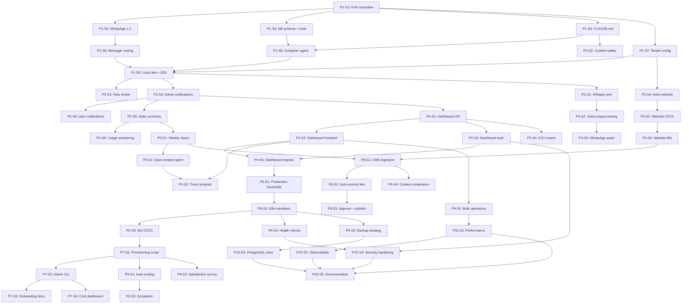

# Stories Index — Constituency Complaint Chatbot

## Overview

This index tracks all user stories across 10 phases of the constituency complaint chatbot project. Each story follows TDD workflow and must be completed in dependency order.

---

## All Stories

### Phase 1: Core Complaint Bot (Weeks 1–2)

| ID | Title | Status | Dependencies |
|----|-------|--------|-------------|
| P1-S1 | Fork nanoclaw and set up project structure | ✅ Complete | — |
| P1-S2 | Extend WhatsApp channel for 1:1 chats | ✅ Complete | P1-S1 |
| P1-S3 | Create database schema and shell script tools | ✅ Complete | P1-S1 |
| P1-S4 | Write CLAUDE.md — the bot's brain | ✅ Complete | P1-S1 |
| P1-S5 | Configure container agent for complaint handling | ✅ Complete | P1-S3, P1-S4 |
| P1-S6 | Implement message routing in orchestrator | ✅ Complete | P1-S2 |
| P1-S7 | Create tenant configuration system | ✅ Complete | P1-S1 |
| P1-S8 | Local development setup and end-to-end testing | ✅ Complete | P1-S5, P1-S6, P1-S7 |

### Phase 2: Rate Limiting, Safety & Admin Notifications (Weeks 3–4)

| ID | Title | Status | Dependencies |
|----|-------|--------|-------------|
| P2-S1 | Implement rate limiter | ⬜ Not Started | P1-S8 |
| P2-S2 | Harden content safety in system prompts | ⬜ Not Started | P1-S4 |
| P2-S3 | Build admin group notification system | ⬜ Not Started | P1-S8 |
| P2-S4 | User notification on status updates | ⬜ Not Started | P2-S3 |
| P2-S5 | Daily summary scheduled task | ⬜ Not Started | P2-S3 |
| P2-S6 | Usage volume monitoring | ⬜ Not Started | P2-S5 |

### Phase 3: Voice Notes & Static Website (Weeks 5–6)

| ID | Title | Status | Dependencies |
|----|-------|--------|-------------|
| P3-S1 | Deploy Whisper pod on k8s cluster | ⬜ Not Started | P1-S8 |
| P3-S2 | Voice note preprocessing and validation | ⬜ Not Started | P3-S1 |
| P3-S3 | Modify WhatsApp channel for audio messages | ⬜ Not Started | P3-S2 |
| P3-S4 | Build static website with Astro | ⬜ Not Started | P1-S7 |
| P3-S5 | Website CI/CD pipeline | ⬜ Not Started | P3-S4 |
| P3-S6 | Kubernetes deployment for website | ⬜ Not Started | P3-S5 |

### Phase 4: Web Admin Dashboard (Weeks 7–8)

| ID | Title | Status | Dependencies |
|----|-------|--------|-------------|
| P4-S1 | Dashboard API | ⬜ Not Started | P2-S3 |
| P4-S2 | Dashboard frontend | ⬜ Not Started | P4-S1 |
| P4-S3 | Authentication for dashboard | ⬜ Not Started | P4-S1 |
| P4-S4 | Kubernetes ingress for dashboard | ⬜ Not Started | P4-S2, P4-S3 |

### Phase 5: Analytics, Reporting & Opus Deep Analysis (Weeks 9–10)

| ID | Title | Status | Dependencies |
|----|-------|--------|-------------|
| P5-S1 | Weekly constituency report | ⬜ Not Started | P2-S5 |
| P5-S2 | Opus 4.6 for deep analysis tasks | ⬜ Not Started | P5-S1 |
| P5-S3 | Complaint trend analysis | ⬜ Not Started | P4-S2, P5-S2 |
| P5-S4 | Export functionality | ⬜ Not Started | P4-S1 |

### Phase 6: Production Deployment (Weeks 11–12)

| ID | Title | Status | Dependencies |
|----|-------|--------|-------------|
| P6-S1 | Create production Dockerfile for the bot | ⬜ Not Started | P4-S4 |
| P6-S2 | Kubernetes manifests for all components | ⬜ Not Started | P6-S1 |
| P6-S3 | CI/CD pipeline for bot | ⬜ Not Started | P6-S2 |
| P6-S4 | Health checks and monitoring | ⬜ Not Started | P6-S2 |
| P6-S5 | Backup strategy | ⬜ Not Started | P6-S2 |

### Phase 7: Multi-Tenant Provisioning (Weeks 13–14)

| ID | Title | Status | Dependencies |
|----|-------|--------|-------------|
| P7-S1 | Tenant provisioning script | ⬜ Not Started | P6-S3 |
| P7-S2 | Shared admin CLI | ⬜ Not Started | P7-S1 |
| P7-S3 | Tenant onboarding documentation | ⬜ Not Started | P7-S2 |
| P7-S4 | Cross-tenant cost dashboard (optional) | ⬜ Not Started | P7-S2 |

### Phase 8: WhatsApp CMS for Website Updates (Weeks 15–16)

| ID | Title | Status | Dependencies |
|----|-------|--------|-------------|
| P8-S1 | Content ingestion from WhatsApp | ⬜ Not Started | P3-S6, P5-S1 |
| P8-S2 | Auto-commit to dev branch | ⬜ Not Started | P8-S1 |
| P8-S3 | Approval and publish flow | ⬜ Not Started | P8-S2 |
| P8-S4 | Content moderation | ⬜ Not Started | P8-S1 |

### Phase 9: Advanced Features (Weeks 17–18)

| ID | Title | Status | Dependencies |
|----|-------|--------|-------------|
| P9-S1 | Auto-routing by category | ⬜ Not Started | P7-S1 |
| P9-S2 | Escalation automation | ⬜ Not Started | P9-S1 |
| P9-S3 | User satisfaction survey | ⬜ Not Started | P7-S1 |
| P9-S4 | Bulk operations from dashboard | ⬜ Not Started | P4-S2 |

### Phase 10: Polish & Scale Prep (Weeks 19–20)

| ID | Title | Status | Dependencies |
|----|-------|--------|-------------|
| P10-S1 | Performance optimization | ⬜ Not Started | P9-S4 |
| P10-S2 | Observability | ⬜ Not Started | P10-S1 |
| P10-S3 | PostgreSQL migration path (document only) | ⬜ Not Started | P6-S5 |
| P10-S4 | Security hardening | ⬜ Not Started | P4-S3, P6-S4 |
| P10-S5 | Documentation | ⬜ Not Started | P10-S1, P10-S2, P10-S3, P10-S4 |

---

## Summary

| Phase | Stories | Description |
|-------|---------|-------------|
| Phase 1 | 8 | Core complaint bot — WhatsApp, SQLite, Agent SDK, CLAUDE.md |
| Phase 2 | 6 | Rate limiting, safety guardrails, admin group integration |
| Phase 3 | 6 | Voice notes (Whisper), static website (Astro) |
| Phase 4 | 4 | Web admin dashboard (Hono API + React SPA) |
| Phase 5 | 4 | Analytics, Opus reports, CSV export |
| Phase 6 | 5 | Production k8s deployment, CI/CD, backups |
| Phase 7 | 4 | Multi-tenant provisioning and admin CLI |
| Phase 8 | 4 | WhatsApp CMS for website updates |
| Phase 9 | 4 | Auto-routing, escalation, satisfaction surveys |
| Phase 10 | 5 | Performance, observability, security, documentation |
| **Total** | **50** | |

---

## Dependency Graph



---

## Critical Path

The longest dependency chain determines the minimum time to completion:

```
P1-S1 → P1-S3 → P1-S5 → P1-S8 → P2-S3 → P2-S5 → P2-S6
                                    ↓
                                  P4-S1 → P4-S2 → P4-S4 → P6-S1 → P6-S2 → P6-S3 → P7-S1 → P9-S1 → P9-S2
                                                                                                        ↓
                                                                              P9-S4 → P10-S1 → P10-S5
```

**Critical path length**: ~20 stories (minimum sequential work)

---

## Parallel Work Opportunities

Several story chains can be worked on concurrently:

1. **Within Phase 1**: P1-S2, P1-S3, P1-S4, P1-S7 can all start after P1-S1
2. **Phase 2 + Phase 3**: P2-S2 (safety) and P3-S1 (Whisper) can run in parallel
3. **Phase 3 voice + website**: Voice track (P3-S1→S3) and website track (P3-S4→S6) are independent
4. **Phase 4 + Phase 5**: P5-S4 (export) can start as soon as P4-S1 (API) is done
5. **Phase 6**: P6-S3, P6-S4, P6-S5 can all start after P6-S2
6. **Phase 8 + Phase 9**: Largely independent of each other
7. **Phase 10**: P10-S3 (PostgreSQL docs) can start as soon as P6-S5 is done
